# Lab Protocols

----------

## Meetings and Training

----------

### Lab Meetings

We are happy to have a range of students join us for weekly lab meeting, whether you are an official member of the lab, or are just visiting – we want a diversity of perspectives in the lab, so join in and make your voice heard.

You might be wondering why we need a protocol for a lab meeting? The answer is simple – to make the meetings as time efficient, cohesive, and productive as possible. To achieve that goal, we follow a structured template for weekly lab meetings:

#### Meeting Blocks

The first layer to the lab meeting structure is to have ‘Meeting Blocks’ which focus the content of our lab meetings for set periods of time (typically 3-5 weeks) on a particular topic. The topics of the Meeting Blocks are decided as a group and will be chosen for strategic purposes (e.g., if we are writing a grant or paper on a particular topic area we might assign a meeting block to that topic, likewise – if we are exploring measures for a new study, we could assign a meeting block to searching for a range of measures and deciding on the best available). You can find a list of potential Meeting Block topics at the end of this document. If there is a topic of high general interest to the lab, we can also schedule a meeting block on it (even if we don’t directly research that topic). At the end of each meeting block we will discuss the next block assignment as a group. If you have an idea for a meeting block, feel free to bring it up at the end of the current block (and add it to the list in this bookdown project).

#### Syllabus Development

The first step in a meeting block will be to develop a syllabus for the coming weeks. The syllabus can either be worked on as a group (e.g., in the first meeting of a new block), or one person can be in charge of developing the syllabus.

*Roles & Responsibilities*

Select a sub-topic or research question for each meeting within the block.
Select a set of readings/material (can be movie clips, podcasts etc.) to go through each week (keep in mind that people have limited time to review the material for lab meeting so assign one primary reading/material and place add additional materials into a supplement, in case people wish to review further).
Make a document for the meeting and share it with all meeting attendees.
Make sure that people are signed up to lead each meeting in the block.
Be in charge of sending reminders for the meetings in the block.
Make any meeting notes at the end of each meeting, and make sure the paper doc is up to date at the close of the meeting.
Make a post on the BABLab twitter for each meeting so people know what we are talking and thinking about.

#### Meeting Leaders

Each meeting will be assigned a meeting leader. The leader is the person who has chosen or been assigned the primary reading or media material for that week.

*Roles and Responsibilities*

Read/watch/listen to the media assigned for that week in detail.
Think about themes that can be brought up in the lab meeting to discuss as a group.
Be ready to facilitate the meeting and stimulate conversation.
Keep the meeting on track (practice those assertive conversation steering techniques!).
The meeting leader does NOT need to make slides, prepare food, or do anything else beyond the roles and responsibilities outlined above.

#### Meeting Attendee

It is not always possible to read/watch/listen to the media for every lab meeting in detail. That is why we assign one person (the meeting leader) to do a deep dive into the material each week. While a deep dive is not necessary, all meeting attendees are expected to be familiar with the media and topic of conversation each week so that they may contribute meaningfully to discussions.

*Roles and Responsibilities*

Familiarize yourself with the media being presented that week. If you have time, do a deep dive too.
Be thoughtful in the lab meetings and try to make constructive comments.
If you come across additional material that you think would be good to include in the lab meeting supplement, add it into the paper doc (on Dropbox).
Try to connect the discussions in lab meeting with the past meetings in the current meeting block, as well as with discussions in past blocks.

#### Potential Lab Meeting Block Topics 

(in no particular order)

 - <s>Sensitive periods in learning and memory</s>
 - <s>Mind Brain Body Study: Questionnaires</s>
 - Role of the hippocampus in learning and memory across development
 - Nutritional Psychiatry
 - Nutrition and cognitive development
 - How does early adversity or lifetime stress affect the microbiome?
 - Bottom up: microbiome influences on brain and behavior
 - Top down: brain and behavioral influences on microbiome
 - Mind Brain Body Study: In lab task review
 - Multivariate analytical techniques in fMRI
 - Microbiome methods
 - Electrogastrograph – what do we know about the signal?
 - Heart Rate Variability and early life stress
 - Integrating physiological measures to enrich our understanding of behavior
 - Kind of crazy ideas, but wouldn’t it be cool if they worked session.
 - Research group highlight - we pick a research group (or even a general research topic) and review the body of work they engage in, or in the case of the research topic, who the big research groups in the field are.

----------

### Trainee Tuesdays & Thursdays 

In order to encourage "deep work" time, we are implementing *Trainee Tuesdays and Thursdays*!

All trainings, meetings, questions/concerns that will take longer than 10 minutes (unless URGENT) should be scheduled on Tuesdays and Thursdays if possible.

Please feel free to schedule a meeting if you'd like to discuss your research/work more deeply or learn a new skill.

If you are simply having an issue with an assignment, before you schedule a meeting with a lab manager we ask that you try the following steps in this order:

 1. Check the OSF protocol - there might be step-by-step instructions for your issue in the BABLab OSF or study specific OSF protocols
 2. Watch a training video - if one exists for the issue/task at hand
 3. Consult a fellow RA - they may know what to do
 4. Consult a senior RA
 5. Make a list of notes in your RA notebook about the problems you are having and present them for discussion at Thursday's RA meeting
 5. Finally, schedule a one-on-one meeting with Emily or Kristen

To do so, please create an event on the BABLab calendar.

Please create this event on the blue BABLab calendar using the template below during a time the lab manager is free. Invite yourself and the lab manager you'd like to meet with! 

*Title: Meeting - "Meeting topic"  
Description: "Brief meeting description"  
Guests: Individuals invited to the meeting*

Example: 

I (Emily) have also shared my personal calendar with the BABLab account, so you can see when I am available to meet with you. You can access it by selecting "Emily Towner" from "Other calendars" in the BABLab calendar. The off-white "busy" slots are times I am unavailable (doctor's appointments, non lab-related meetings etc.). 

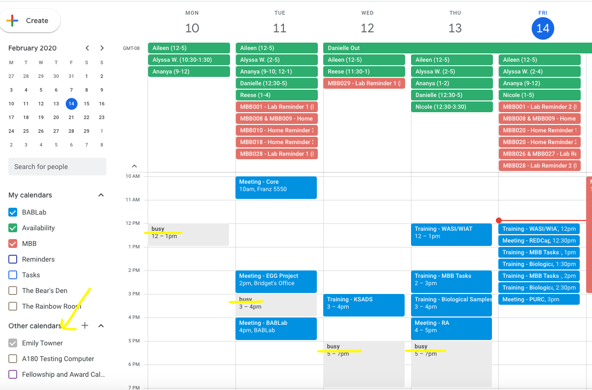

----------

### Clinical Meetings

<h4>Purpose</h4>

The purpose of clinical meetings are to discuss and review ongoing clinical interviews (KSADs), troubleshoot any recent difficulties, and learn helpful interviewing tactics for future clinical interviews. During the meeting, you will present the team with background information from your clinical interview and walk through each supplement. 

<h4>What To Prepare</h4>

Using a shared Dropbox Paper document, please prepare the following:

 - Who you are presenting
      - Participant's KSADS file
      - Date/time of session
 - Brief background 
      - Was the child bio/adopted?
        - Age of adoption
      - Was there any prenatal exposure?
      - Any trouble in school?
 - Supplements
      - Your thought process on why/why not you went through each supplements/diagnoses you have assigned
 - Personal opinions
      - What was the child participant like in the session? (note relevant behaviors for context)
 - WASI/WIAT
      - A quick overview of the participant's WASI/WIAT (admission and scores)
 - Questions for the team
    - Any situations you feel may have been difficult to address during the clinical interview

*These meetings are also a safe space to debrief potentially difficult interviews.*

----------

## Mail

----------

### USPS

When sending things out USPS, you can place your recharge ID under the sender’s address, circle it, & drop it in the outgoing mail bin in 1282 (faculty mailroom)

#### How to check your Charges

- Go to the MDDS ucla mail servicesS
- Click on MDDS Billing Data and sign in with your UCLA logon ID
- Navigate to the "Billing Activity Review" page
- At the Search bar: the financial services dept. code is 0875 and enter the appropriate recharge ID/month and year
- Under the Outgoing Mail Billing Activity, there will be a total cost of charges as well as number of pieces of mail for this FAU during the mobth/year you selected

----------

## Recycling & Waste

We can leave small items outside our door for recycling/trash pickup. For large items we should bring them to the A-level loading dock to be recycled.

----------

## Purchasing

----------

### PAC Orders

PAC forms are used for most purchasing requests (besides Amazon which we can order from directly with our Amazon business account). Please consult the [UCLA preferred vendors list](http://staff.purchasing.ucla.edu/Portal/app/agreements/agreementsummary.aspx) first before submitting a PAC form for an outside vendor.

- Save any quote to (BABLAB/Lab/Finances/Purchasing/)
- Check Trello purchasing board for existing item
- If no existing item, create one and add description based on templates
- Fill out blank PAC form located in (BABLAB/Lab/Documents/Financial_templates/Purchasing/)
- Save to (BABLAB/Lab/Finances/Purchasing)
- Email the completed PAC order form to   psych-orders@psych.ucla.edu
    - **Subject** - CB, [Fill in Vendor] Request, Bridget Callaghan
    - CC’ Bridget (bcallaghan@ucla.edu) - do not need signature if PI is cc’d
- Complete item order information on Trello purchasing board
- Save PO (purchase order) and CONF (confirmation) if received
- Once item is received lab manager log amount in funds spreadsheet
    - Add in any tax/shipping/expense that wasn’t accounted for on Trello to most expensive item 
    - Mark as "Logged" on Trello 

----------

### Amazon Orders

Instructions for checking out via our Amazon Business Account.

 - Check for existing item on Trello
 - If existing item, move to "To Order" list, change label to not logged, and create new instance of purchase in description box
 - To checkout via Amazon, Choose a Group
    - Upon clicking “Proceed to Checkout” you will arrive to the screen below.  Select your fund manager’s group and click continue: 
    - Be sure to select the correct group to avoid your order being rejected or sitting in a queue that is not being reviewed.  In the event that your fund manager is out of the office, please check with the Business Office before starting your Amazon Business order so that we can add you to another group temporarily.  Otherwise, the order will remain in your fund manager’s queue until they are back in the office and able to approve orders. 
- Business Order Information
    - Enter the Full Accounting Unit (FAU) or Recharge ID in the Purchase Order (PO) Number field and enter a business justification in the Comments for Approver field. These fields are required for the Psychology Department.  If this information is not provided, your fund manager will reject the order. 
    - NOTE: Business justifications must describe the purpose of items being purchased, how and where the items will be used.  Please be sure to be as detailed and specific as possible.  If you are purchasing an item flagged as restricted your fund manager may reach out to you for additional information.  
    - Restricted items are not necessarily unallowable, but may require additional levels of approval from the Pcard Administrator in Purchasing before we can charge it to a Pcard.
- Next, select the appropriate shipping address 
- Next, you will select the method of payment.  This should be a VISA with your fund manager’s name on the card.  You do not have the option to edit this page and it is not necessary to include a reference number. Click continue.
- Review your order details and once confirmed, click on submit order for approval.
- Complete item order information on Trello and move to "Submitted" list
- Once placed, move item to "Placed" list on Trello
- Once item is received, lab manager to log amount in funds spreadsheet
    - Add in any tax/shipping/expense that wasn’t accounted for on Trello to most expensive item 
    - Mark as "Logged" on Trello
    
----------

### Reimbursement

For reimbursement: 

- Fill out a blank reimbursement form found in  (BABLAB/Lab/Documents/Financial_templates/Reimbursement/)
- Save reimbursement form to (BABLAB/Lab/Finances/Reimbursement)
- Email the completed reimbursement form to   psych-orders@psych.ucla.edu
    - Subject - CB, [Fill in Vendor] Reimbursement, Bridget Callaghan
    - CC’ Bridget (bcallaghan@ucla.edu) - do not need signature if PI is cc’d
- Lab manager log reimbursement amount in funds spreadsheet

----------

### Guest Parking Passes

 - Email Tyler Tuione (tuione@psych.ucla.edu) saying you would like to purchase guest parking passes.
 - Information to include in this email: 
    - Number of passes to order
    - Recharge ID for fund to charge
- Wait for Parking Services to call the lab (about a week), record the confirmation code they give you.
- Pick up the passes with the confirmation code at 555 Westwood Plaza, Suite 100.

----------

### Petty Cash

 - Fill out a blank IRB research payment request form (for cash or card)(BABLAB/Lab/Documents/Financial_templates/Petty_cash/)
 - Send it to Brian Hoang (brianhoang@psych.ucla.edu) for a signature
 - Submit the form at this [site](https://sa.ucla.edu/MessageCenter/OneStop/Home/PostMessage?topicId=293)
 - It can take up to 10 business days for them to reply back.
 - When they recontact with a delivery time, ensure that either of the people who signed the form (Bridget and an RA) are in the lab at the time of delivery to sign off on the order. 
 - They will not deliver the cash if one of the signers is not present
 - Once the disbursement is received, log it on the study specific payment log
 - Ask the lab manager to log the pettycash amount in the funds spreadsheet
 
----------

### Vendor specific protocols

Some vendors have special requirements or instructions to make purchases from them. 

Biopac
- Email aimeew@biopac.com and frontdesk@biopac.com

Uprinting

 - Go to Uprinting.com and log in.
 - Select the items you want to purchase and add them to the cart. 
     - Note that you need to have the pdf or image files on-hand and make sure they match the dimensions of what they will be printed on
- When checking out, select “Terms” as the payment method
- Create and submit a PAC form to purchasing as usual, but also cc' jhoan.e@digitalroominc.com and request that purchasing get in touch with her to pay for the order

----------

### Logging purchases on Trello

1. Go to the "Purchasing" board on Trello. It should be green.There are different tabs:
  - **To Return**: items that will be returned
  - **Maybe**: items that may be bought
  - **To Order**: items to order/ buy
  - **Submitted**: orders that have been submitted
  - **Placed**: orders that have been placed
  - **In Stock**: items that have arrived and are in lab

2. Add a card to "To Order" - name it with this format: **item being bought - $price**

3. Add the following labels:
  - **Budget: Nonlogged** (always log this by default)
  - **Fund** (ask lab manager whether it's Startup, R00, or other fund)
  - **Category** (ask lab manager which category)

4. Add the link of the item on 'add an attachment'. Rename the link the exact name of the item as written on Amazon (or whatever website).

5. Add a description with this format:
  - Units: (insert amount of item, ex. 20 pencils)
  - Orders: (insert how many orders placed, ex. 1 order of 20 pencils)
  - Date submitted: (insert date we submitted order)
  - Date placed: (insert date vendor has placed order)
  - Date received: (insert date we got it in lab)
  - If the card is something that may run out eventually (ex. granola bars, notebooks) add an approximate due date.

6. Whenever an item has been submitted, placed, and in stock, move the card into its respective tab. 

Watch the video for a detailed explanation.

<iframe width="560" height="315" src="https://www.youtube.com/embed/6YPngZ2cZto" frameborder="0" allow="accelerometer; autoplay; encrypted-media; gyroscope; picture-in-picture" allowfullscreen></iframe>

----------

### Fund Log - Lab Manager 

**Items to add to the Fund Log**

- TRELLO - amazon purchases
- reimbursements
- purchases in Box (uPrinting should be stored on box)
- petty cash
- staff reseracher salaries 
- usps charges through mdds (participant payments, magic boxes)
- fedex charges through financial report/receipts Brian sends
- lamination - must email them for receipts
- DNA genotek on financial report (and they should send receipts for each PO)
- guest permits through emailing tyler

----------

## Technology

----------

### Slack

If you haven’t already found this out for yourself, emails are a clunky way of communicating for most lab needs. Moreover, most people will find that they have a backlog of emails awaiting their attention. For this reason, we will use Slack for the primary means of lab communication.

The beauty of Slack is that you only subscribe to the channels that concern you. For messages to one person or a small group, use direct messages. If you have to include out-of-lab recipients, use e-mail. If you have a paper you want to share, download it and then upload it to Slack in the #papers channel.
 
Full-time lab members should install Slack on their computers and/or phones and check it regularly (during working hours). Part-time lab members should also check Slack when they are working in the lab as there may be important messages in there for them.
 
Of course, if there is an emergency, and you need to contact Bridget, use her email or phone or drop into her office.

| Slack Channel                  | Type    | Purpose                                                                                                            |
| -----------------------------  | ------- | -------------------------------------------------------------------------------------------------------------------|
| #bablab_core                   | Private | For private communication between the core team - this includes the PI, Lab Managers, Postdocs, and Grad Students  |
| #bablab_ra                     | Private | For private communication between the lab managers and all the research assistants                                 |
| #bablab_senior_ra              | Private | For private communication between the lab managers and the senior research assistants                              |
| #diversity                       | Public  | For lab-wide communication regarding lab commitment to diversity, inclusivity, and allyship                             |
| #general                       | Public  | For lab-wide communication and announcements                                                                       |
| #meetings_lab                  | Public  | For notes or communication related to lab meetings                                                                 |
| #methods_fmri                  | Public  | Sharing wisdom on fMRI data collection / analysis or asking (and answering) the fMRI questions of others           |
| #methods_mb                    | Public  | Sharing wisdom on microbiome data collection / analysis or asking and answering the microbiome questions of others |
| #notes_conferences             | Public  | For taking notes at conferences                                                                                    |
| #papers                        | Public  | Sharing links to lab-relevant papers and discussing them                                                           |
| #random                        | Public  | Non-work-related chatting – e.g., pics of pets, funny cartoons etc.                                                |
| #recruitment                   | Public  | Any ideas you have for recruiting youth into our study                                                             |
| #rejection_collection                         | Public  | A collection of rejections and reflections!                     |
| #stats                         | Public  | To ask and answer questions about statistical analyses                                                             |
| #study_inside_out       | Private | To discuss issues related to the EGG and Emotionality study                                                        |
| #study_pup       | Private | To discuss issues related to the Parenting Under Pressure Study                                                        |
| #study_mbb                     | Private | To discuss issues related to the Mind, Brain, Body study                                                           |
| #study_transfer_mental_health  | Private | To discuss issues related to the Transfer Mental Health Study                                                      |
| #tips_coding                   | Public  | Sharing wisdom on code writing or asking (and answering) the coding questions of others                            |
| #writing_group                | Private  | For writing accountability and motivation                            |

----------

### Box

We have moved over to Box for our file storage service. This works very similarly to Google Drive or Dropbox, but is more secure. Additionally, each lab member can have their own account, it's free and great for collaboration!

Please download [Box Drive](https://www.box.com/drive) to use. 

1. Click download for your operating system

2. After installing, you may need to click allow in your security preferences

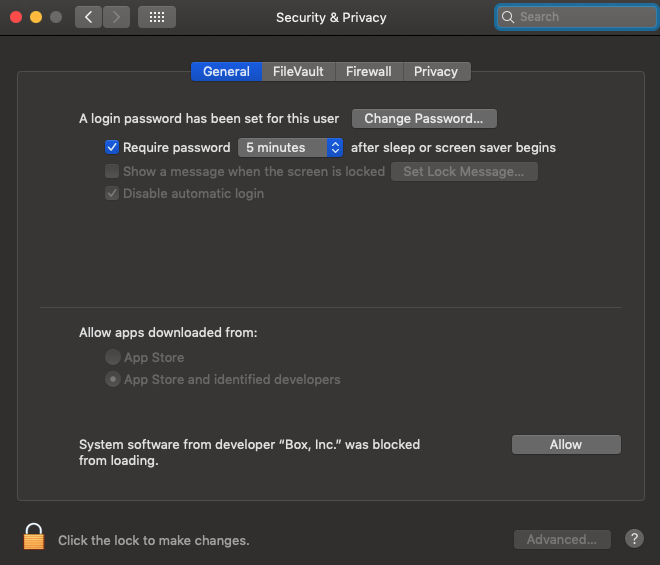

3. Log in with your UCLA email (make sure to accept the Box sharing request first)

4. Now you can use Box on your desktop.

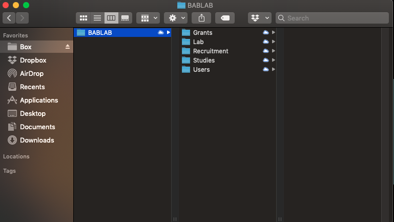

5. On the web version, change your notification preferences so that you don't get an email every time someone uploads a file by unchecking the boxes below

----------

### Using Trello
1. There are multiple lists on the Tasks Board! 
 These include: Doing, To-do, Later and Done. 
 Depending on the task, simply move it to the right list once you progress with it.

- **To Do:** Current tasks to complete.
- **Doing:** Tasks currently being done.
- **Later**: Tasks not as pressing, but still must be done.
- **Done**: Completed tasks.
2. **To add a card**: Click '+ Add Another Card' under the appropriate list. There are multiple functions within this:
- You can add members, labels (useful for studies), checklist, attachment, due date and more to the back of the card. This information will show when you click on the card.
3. **Show Menu function:** This is a great way to search specific items, such as your own name for tasks, or the study for which there are tasks for, or tasks which have upcoming due dates. 

<iframe width="560" height="315" src="https://www.youtube.com/embed/_Ry-SnJygy8" frameborder="0" allow="accelerometer; autoplay; encrypted-media; gyroscope; picture-in-picture" allowfullscreen></iframe>

----------

### Server

In addition to Box, we make regular biweekly backups to a dedicated psychology department server (in addition to two external drives)
 
To connect to the CallaghanLab server:
 
*Contact the lab manager first to set up your credentials.
 
On a Mac –

- From the dropdown menu under "Go", select “Connect to Server...” (Apple + K)
- Enter the network/server address: `smb://pythia.psych.ucla.edu/Users/CallaghanLab/`
- Click on “Connect”.
- A dialogue box will prompt you for your credentials. Enter your credentials obtained from Psychology IT and click on “OK”.
- If everything was entered correctly from above, the mapped drive will appear under "Shared" in the Mac's Finder.

 
On a PC –

- From the Windows file explorer, right mouse click on "Computer" for Windows 7 or "This PC" on Windows 8/10.
- Select "Map network drive".
- Specify an available "Drive" letter from the dropdown menu.
- Enter the network/server location for the "Folder" field and click on "Finish".
    - Network/server location: `\\pythia.psych.ucla.edu\Users\CallaghanLab\`
- Enter your username and password that was provided by Psychology IT in the "network credentials" popup dialogue box and click on OK.
- If everything was entered correctly from above, the mapped drive will appear under "Network locations" when you click on "Computer/This PC".
- After the drive has been mapped, logged out of Windows to "logout" from the network drive.
- Don't right mouse click on the mapped drive and select "Disconnect". This will only unmap the network drive and you will have to go through the process all over again.

 
To connect off-campus connect to the UCLA/BOL VPN and let it run in the background prior to logging into the mapped drive you had configured on your computer.

How-to download/install the [Cisco VPN client](https://help.bol.ucla.edu/kb_view.do?sysparm_article=kb0010923).

> Every night the server is backed up to the Life Sciences data center in Hershey Hall.  That's always been the case.  To make those nightly backups more safe, there is another copy of the backups stored offsite (i.e. to prevent losing both the server AND the backups in a fire, earthquake, etc.)
> 
> Once we have Shadow Copy enabled, we'll also have more direct access to backups, so we won't need to work with Life Sciences to retrieve backups.  Psych IT will be able to grab a recent copy of your files/folders ourselves.  We'll also have access to incremental backups (i.e. yesterday's copy, two day old copy, three day old copy...up to two weeks back).
> 
> So at that point we'll have 3 forms of backup, and plenty of safety net.
> 
> - Dave (Psych IT)

----------

### Dropbox Paper

The lab has a shared Dropbox Paper account — which is slightly different than regular Dropbox file storage. On the Dropbox Paper, we will place collaborative documents. We will grant you access permission to various folders in the Dropbox Paper account, You may need to initialize an account with the email we grant access permission.

----------

### GitHub

The lab’s GitHub should be used to share code and data with people outside of the lab (i.e., people not on our IRB). Not all data can be shared (because of IRB restrictions) and not all data that can be shared should be shared immediately. Speak with Bridget about when to share data, and what needs to be done to the data (e.g., the level of de-identification required) before we share it. Ask the lab manager to get access to the lab’s GitHub.

Our lab manual, lab wiki, and study wikis are also hosted on our GitHub.

----------
 
### Google Calendars

The lab has many Google calendars and you should subscribe to those that make sense for your unique situation.
 
1. **BABLab:** Used for lab meetings, out of schedule meetings, birthdays, formal lab events etc.
2. **Availability:** If you are part time, please place the hours you plan to come into the lab on this calendar. If you are going to be away, please place the dates and times on this calendar. This is critical as the lab manager will use this information when scheduling people to run participants for our studies. Bridget and the core team will also put her out of office times on this calendar to help people with scheduling.  
3. **MBB:** Used for booking sessions and reminders for the Mind, Brain, Body study
4. **The Bear's Den:** used to reserve time in experimental room 1 
5. **The Rainbow Room:** used to reserve time in experimental room 2 
6. **A180 Testing Computer:** the SAND Lab room that can be used for blood spots 
7. **HPL1333:** The Health Psychology Lab room that can be used for blood spots

----------

### E-mail

We have an email listserv for communicating with the whole lab and individuals who subscribe to our list - including visitors and students from other labs who attend our meetings, visiting scholars, etc. 
 
The email is: **bablab@googlegroups.com**

If you are thinking about joining the lab and would like to be notified about upcoming lab meetings, please request to join the listserv. 
 
There is also a lab email account which people use to contact the lab to participate in studies (bablab.ucla@gmail.com). This email account will be staffed by the lab manager/s and they will sort the emails in specific folders within the Gmail account. If you are running a study, it is your responsibility to check your study's folder on the lab Gmail every few days and respond to participant inquiries in the "potential" participants folder in relation to your study.

----------

### Gmail Organization
The bablab.ucla@gmail.com email is the lab email for all lab related correspondance. The email is organized with different folders and tabs for all lab and lab studies correspondance.

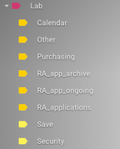

**Lab**: Overarching tab for all lab functioning related emails  

  - **Calendar**: All emails about calendar events go in this tab (invitations to sessions, automatic emails Google sends about calendar events, etc) 

  - **Other**: Google Voice emails about missed calls or texts, anything not important that doesn’t belong in any other email tab 

  - **Purchasing**: Emails about purchases for lab, Amazon purchase confirmation emails 

  - **RA_app_archive**: Tab for RA applications that will not be reviewed anymore / not considering because it has been a long time since person initially expressed interest or otherwise outdated 

  - **RA_app_ongoing**: Tab for emails and app materials of individuals currently being interviewed for a position in the lab. Emails only stay in this tab during the hiring process and are then moved to either RA_app_archive or RA_applications 

  - **RA_applications**: Tab for recent RA applications that can be reviewed if we’re looking to hire someone  

  - **Save**: Tab for *important* emails that don’t fit anywhere else  

  - **Security**: Tab for emails from Zoom about accessing calendar, security alert emails from Google, and any other security related emails  

**Recruitment**: Overarching tabs for all emails about recruitment 

  - **Ads**: Tab for emails about any ads we run – Facebook, Instagram, Craigslist, Patch, Nextdoor, etc. 

  - **Community_contacts**: Tab for emails with organizations or individuals we’ve reached out to for potential collaborations ( e.g. Influencers, community partners)  

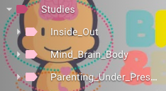

**Studies**: Overarching label for the folders of differnt studies in lab

  - **Inside_Out**: Tab that has all correspondence related to Inside Study previously completed in the lab
  
  - **Mind_brain_Body**: Tab for all correspondence related to ongoing longitudinal Mind Brain Body Study
  
  - **Parenting_Under_Pressure**: Tab for correspondence related to Parenting Under Pressure study previously completed in lab
  

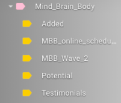

**Mind_Brain_Body**: Tab with all emails related to the Mind Brain Body study 

  - **Added**: Tab for emails with individuals we’ve added to the participant database but that aren’t enrolled in MBB; interest forms that participants fill out on website 

  - **MBB_online_scheduled**: Emails with participants that are enrolled in MBB Wave 1 online 

  - **MBB_Wave_2**: Emails with all the people that are now in Wave 2 of MBB (either already enrolled in Wave 2 or we are in contact about enrolling them in Wave 2)  

  - **Potential**: Tab where correspondence goes for anyone that *has not been added to REDCap or our participant database* but is interested in the Mind Brain Body study.  

  - **Testimonials**: We add this label to any email thread that has a testimonial about MBB (we sometimes ask participants if they’d like to give a testimonial for website)  

----------

### ListServ

**Protocol: Adding MBB Participants to the BabLab Newsletter Google Group**

The Brain and Body Lab has a Newsletter Google Group where we send previous study participants newsletters and updates regarding the research within our lab, and it is important to consistently add new study participant emails to this list, so they can receive our newsletters! 

The BabLab’s Google Groups can be found Here.

Find the group called “Brain and Body Lab News!” – this group contains previous study participants within the lab. 

Click on the “People” tab to view and add new members to the group.
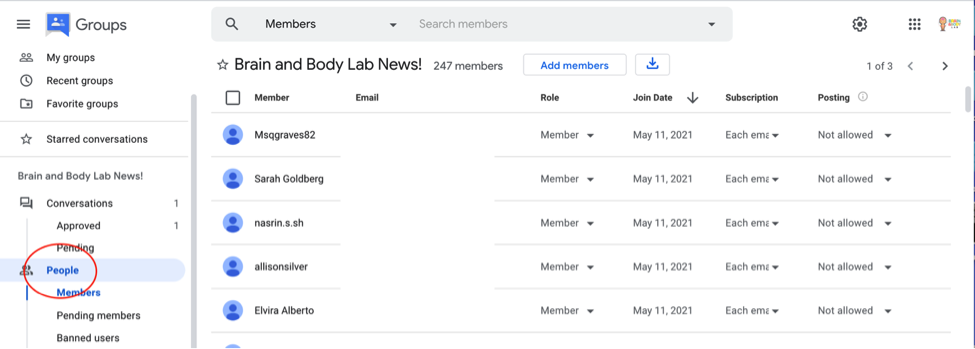

Filter list by “join date” to view the newest members added to the group – and locate these members on the Participant Database. This will make it clear to see when the Newsletter Google Group was last updated, and which names from the Participant database need to be added to the Google Group.

Click “Add Members” and enter any new emails from the Participant Database one at a time in the “Group Members” box. 

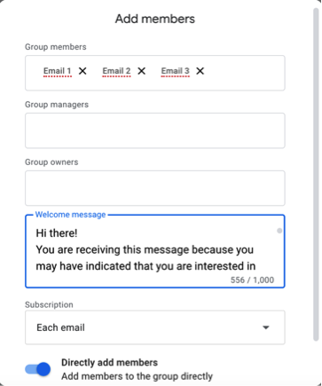

Enter the following message in the “Welcome Message” box before sending.

**“Hi there!
You are receiving this message because you may have indicated that you are interested in opting in to the UCLA Brain and Body Lab’s newsletter, updates, and findings! Thanks for signing up to receive our emails- we’re excited to welcome you to the BAB Lab community!  As a part of our community, you will be hearing about all things new and exciting in our team and our research. We couldn’t be more excited to have you! (Note: If you would like to be removed from this group, please feel free to “unsubscribe” below.)
Sincerely,
The BAB Lab Team”**

Select “Add Members” and all new emails will be directly added to the BabLab Newsletter Google Group. 

**Protocol: Adding all RA applicants to the BabLab Google Group**

The Brain and Body lab also has a Google group for students who have applied to be RA’s in the Lab – so that anyone who is interested in our lab can get lab updates and join in on lab meetings.

The BabLab’s Google Groups can be found Here.

Find the group called “BabLab” – this group includes:  PI (Bridget), postdocs, graduate students, lab managers, paid research assistants/technicians, undergraduate research assistants and volunteers, students from other labs who attend our meetings, visiting scholars, etc.

Click on the “People” tab to view and add new members to the group.

Filter list by “join date” to view the newest members added to the group – and locate these in the Bablab Gmail – in the folders “RA_applications” and “RA_app_archive”. This will make it clear to see when the BabLab Google Group was last updated, and which names/emails from the Bablab Gmail need to be added to the Google Group.

Click “Add Members” and enter any new emails from the RA application folders within Gmail, one at a time in the “Group Members” box. 
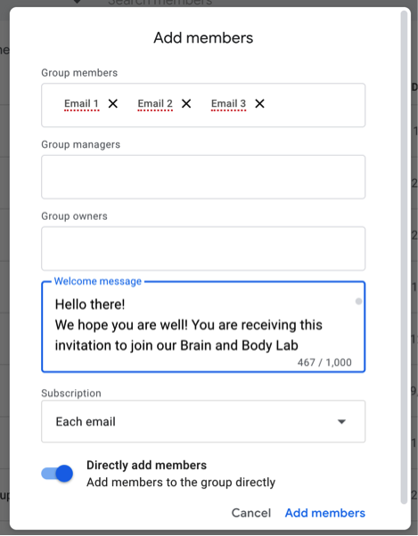

Enter the following message in the “Welcome Message” box before sending.

**“Hello there! 
We hope you are well! You are receiving this invitation to join our Brain and Body Lab google group, as you may have indicated on our google form that you were interested in hearing about BABLab news and about our lab meetings. We use this google group to send BABLab updates, newsletters, lab meeting information, and more! If you have changed your mind, please follow the unsubscribe link below. Thank you! 
Best Regards, 
The Brain and Body Lab Team”**

Select “Add Members” and all new emails from interested RAs will be directly added to the BabLab Google Group. 

----------

### Mac OS - Catalina

If you upgrade your Mac operating system to Catalina, and wish to run tasks on PsychoPy, you must enable the following settings in the image below. 

----------

### REDCap

#### Creating Events

1. Click into Project Setup

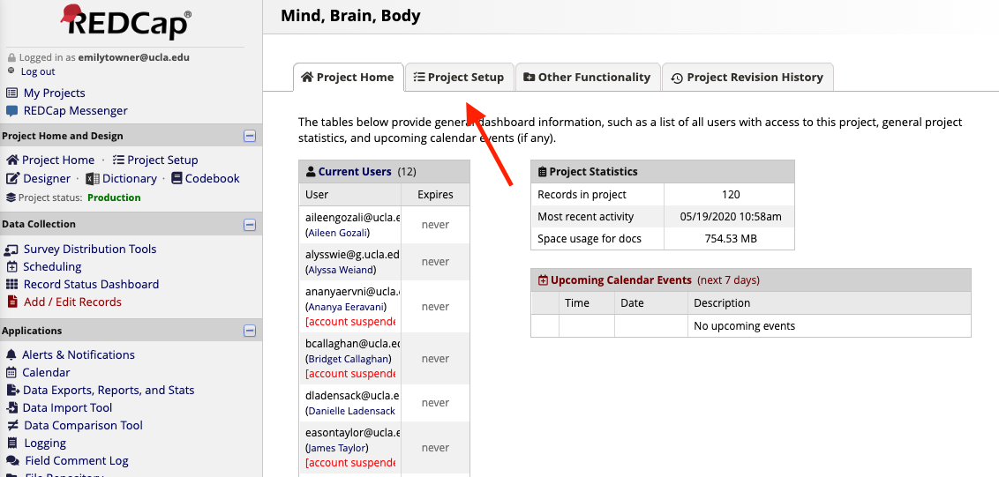

2. Click to either Define Your (New) Event or to Designate Instruments to your Events

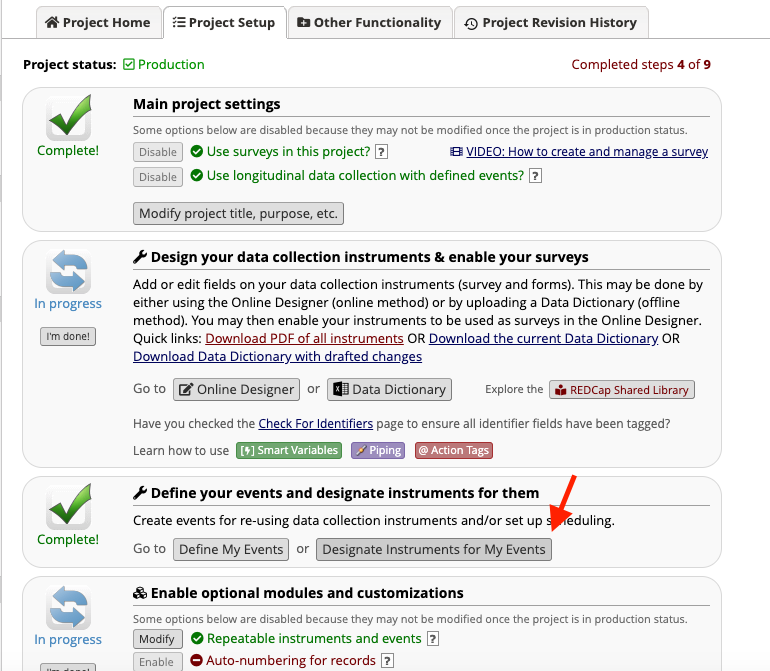

3. Select which Arm you want to designate instruments to

#### Entering Instruments

<iframe width="560" height="315" src="https://www.youtube.com/embed/aKdWA0ABOrU" frameborder="0" allow="accelerometer; autoplay; encrypted-media; gyroscope; picture-in-picture" allowfullscreen></iframe>

#### Using the test logic feature

You can use the test logic with a record feature to see if this question will be shown for a specific participant

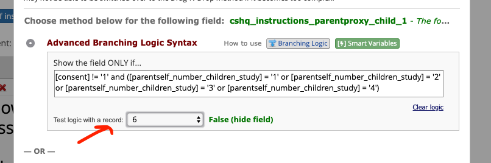

#### Custom Record Dashboards

- to create a custom record dashboard in record status dashboard that you can filter participants to based off of certain characteristics, open your REDCap project and navigate to the record status dashboard then click "Create custom dashboard"

- Refer to the following custom record dashboard settings. Fill out the dashboard title, header orientation, group columns by event, filter logic (based off your qualifying variable), filter by arm (indicate correct arm this dashboard will attend to), and sort by (how the items in the dashboard should be sorted):

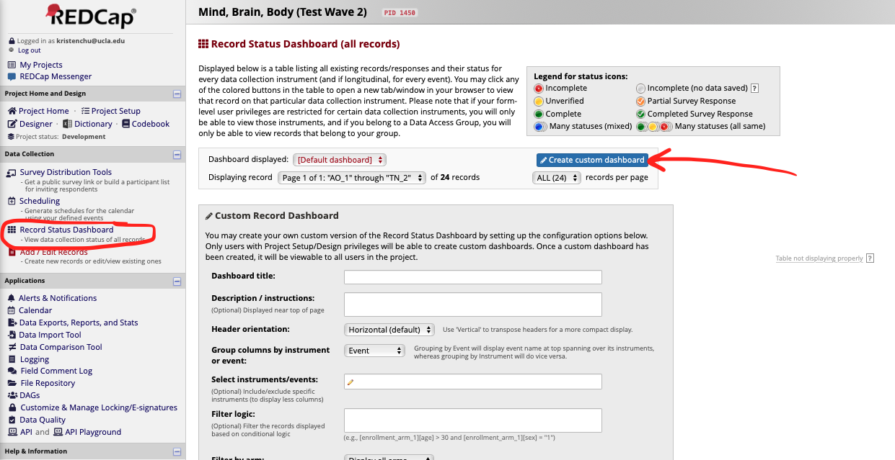

#### Backend of Instument Settings

CHECKLIST for REDCap Survey backends:

- title of survey
- delete survey instructions
- color: BABLAB
- allow respondents to return without needing a return code
- auto continue to next survey
- delete survey completion text

----------

### R

To install R:

 - Go to [R Project](http://www.r-project.org)
 - Click the "download R" link in the middle of the page under "Getting Started"
 - Select a CRAN location (a mirror site) and click the corresponding link
 - Click on the "Download R for (Mac) OS X" link at the top of the page
 - Click on the file containing the latest version of R under "Files"
 - Save the .pkg file, double-click it to open, and follow the installation instructions

----------

### RStudio

To install RStudio:

 - Go to [RStudio](http://www.rstudio.com) and click on the "Download RStudio" button
 - Click on "Download RStudio Desktop"
 - Click on the version recommended for your system, or the latest Mac version, save the .dmg file on your computer, double-click it to open, and then drag and drop it to your applications folder

----------

### Python

To install Python:

- Download the [Anaconda Distribution](https://www.anaconda.com/distribution/)
- Be sure that you download the Python 3.7 version. (Note, this can take upwards of 1-2 hours depending on your internet connection)
- Helpful instructions for these checks can be found on the Anaconda User Guide website: [“Getting Started”](https://docs.anaconda.com/anaconda/user-guide/getting-started/)
- Any issues are most likely due to incorrect installation, which is addressed in the [FAQ page](https://docs.anaconda.com/anaconda/user-guide/faq/)
 
-----------

### VPN to Lab Computers
We have set up a VPN on the mac mini in the Bear Den (on the left side of the room). 
Because this computer has the Acknowledge software installed on it, and has the USB Key for that program you need to use that computer for processing any physiology data. If you are off campus, you can VPN to the computer using the following steps. NB: you will need to have downloaded Cisco Anyconnect - you can access that by clicking [here](https://www.it.ucla.edu/it-support-center/services/virtual-private-network-vpn-clients)

Step 1. Open Cisco and type 'ssl.vpn.ucla.edu' and press 'connect'

Step 2. Type in your UCLA ID and Password (same as you use to get into email)

Step 3. Accept the SSO push to your second device

Step 4. Click 'Accept'

Step 5. Go to the magnifying glass at the top right of your screen and search for Screen Sharing.

Step 6. Type in the IP address for the Bear Den computer: 164.67.125.42

Step 7. Type in the username and pw for the Bear Den computer:
        Username - Brain & Body Lab
        PW - BaBLaB

Step 8. You will see a new window pop up, with a desktop, which is the desktop of the Bear Den computer.

A second option would be to go to the Finder on your Mac, on the top menu bar click 'Go' and then click 'Connect to Server'. Type in vpn://164.67.125.42. This will take you straight to the screen sharing page where you can then perform Step 7 & 8 from above. 

----------

### Google Voice

1)  Go to the app store and search for Google Voice and download the app. The app icon should look like the picture.

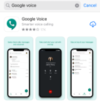

2) When you open the app you will be given the option to choose what account to sign into for Google Voice. Click on add another account to add the BaB lab account. If you are already signed into the BaB lab email on your phone then it will likely already show the account as a sign-in option. 

3) That will open this window in the app and you’ll sign into the BaB lab account. 

4) Once you’re signed in it will show you this page to choose your phone number. Choose skip since your phone number won’t be an option yet. 

5) Now go to settings by clicking the three bars on the top left of the main page of Google Voice.

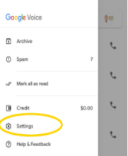

6) Click on devices and numbers to add your phone number to send and receive calls from your phone. 

Note: There are some pre-chosen settings like “ forward messages to email” do not change those. You can customize your notification setting to your preference.

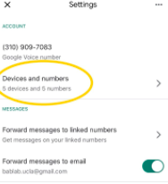

7) Add your phone number by choosing “new linked number”. It will ask you to input your phone then send you a confirmation code. Once you input the code you’re all set up!

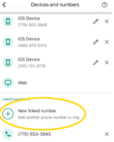

----------

### Burning CDs

1. Connect external DVD drive if your Mac doesn’t have a built-in optical drive. 

2. Insert a blank disk into your drive.  This pop-up will appear.  Click okay.  The disk icon will appear on your desktop.  

3. Create a New Folder of content that you want to burn.  Right click on the file and select “Burn_File Name_to Disc”   

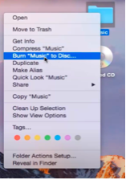

4.This box will pop-up.  Rename file if you wish.  Then select “Burn”. 

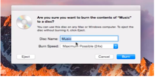

5. Once burning process is complete, the disk icon will appear on your desktop with the name you gave it.  

6. Right click on the CD and click “Eject CD”.  That’s it! 

To watch this in a video: https://www.youtube.com/watch?v=ZCBKSkfnqX8 

----------

### High to low res video

Step 1. Open the file you wish to convert in QuickTime.  QuickTime automatically comes with all Mac devices, so no need to download it if you own a Mac.  Usually when you open the video after you download it, the video automatically opens in QuickTime.  

Step 2. Choose File, then mouse down to Export, and choose an option from the Export menu.
Here, you will see 3 video resolution options and 3 other options:

  - 1080p: QuickTime movie using H.264 or HEVC (H.265), up to 1920x1080 resolution.
  - 720p: QuickTime movie using H.264, up to 1280x720 resolution.
  - 480p: QuickTime movie using H.264, up to 640x480 resolution. 

Step 3. Choose size 480p.  Then Save to your computer.  

Step 4. Go to Box: Studies -> MBB -> Data -> Wave_1_online -> Wave_1_online_parent_child_interactions

Step 5. Go to the folder with the old video.  Click the three dots shown below.  Select “Upload New Version”.  That’s it! 

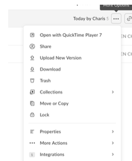

## Equipment

----------

### Biopac

----------

### Printer

 - Make sure you are connected to eduroam wifi
 - Open up Printer & Scanners in System Preferences 
    - If current printer is not working, right click printer and click Reset Printing System
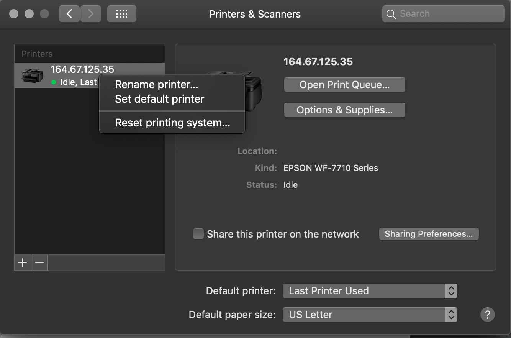
- Reset Computer 
- Open up System Preferences – Printers & Scanners 
- Click on + sign to add a printer 
- Enter IP Address from Printer: 164.67.125.35
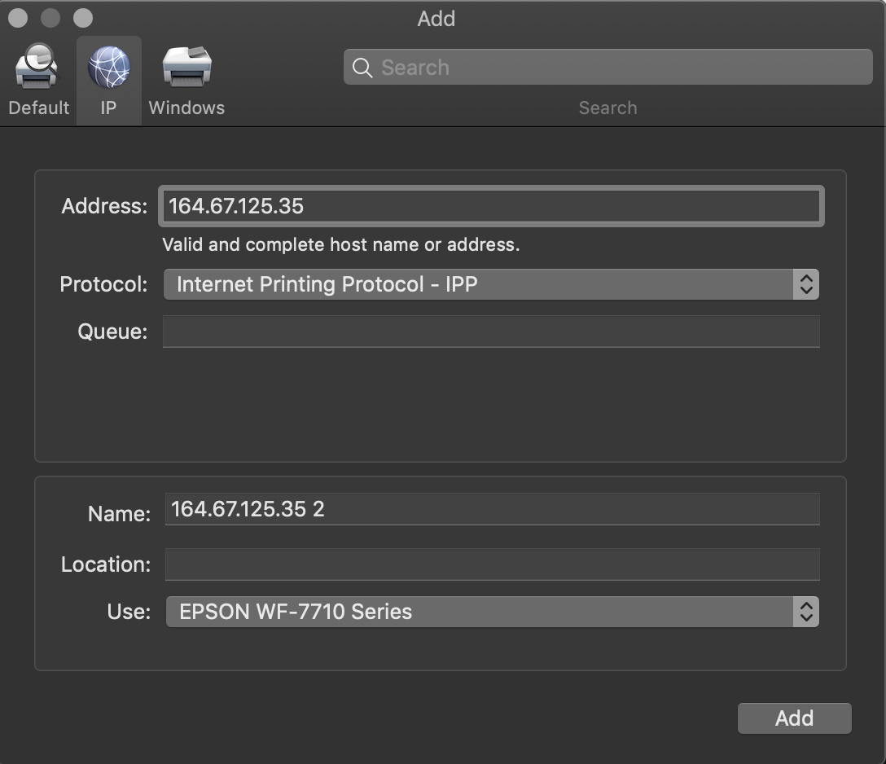

- Make sure Use displays: EPSON WF-7710 Series 
- Click ADD
- Reset your Printer Presets if needed 

----------

## Social Media

----------

### Instagram

The pride and joy of the lab. There is a lot of content to keep track of and to ensure is posted weekly.

General important rules:

- Keep posts short, family-friendly, and accessible.
- If you post on the story, it should also likely be added to a story highlight.
- Stick to the color scheme and aesthetic (this includes matching the text in story highlights to the story highlight cover color).
- Maintain the integrity of the main feed grid (will be elaborated on further down).
- Maintain the consistency of the Lab’s hashtags (will be elaborated on further down).

Feed Content:

- The feed grid is an important part of the aesthetic of the lab’s social media. We can divide the grid into “A Week” and “B Week” rows. Because there are 3 posts horizontally in the grid, there should be 3 pieces of content posted each week (or with relative consistency). 

“A Week”:

- Biome Bites! ad post: This is simply a post saying to check the story for this week’s Biome Bites! installment. The caption for this should be brief and maybe reference the content in the actual story post.
- Lab Meeting ad post OR Email List ad post: Post this on lab meeting day in “A Week”. If there is a speaker or specific topic for the week, discuss that briefly in the caption.
- In “B Week”, don’t post this even if there is a lab meeting. Instead, post a previous Lab Meeting ad post on the story. If there is not a lab meeting during that “A Week”, you should post the Email List ad post instead.
- Brain Bites! ad post: This is simply a post saying to check the story for this week’s Brain Bites! installment. The caption for this should be brief and maybe reference the content in the actual story post.

“B Week”:

- 3 random posts: post pictures from around the lab, from events, or advertisements for upcoming events. Check the existing feed for ideas, and try to stay current with seasons, trends, etc.
- If there is an event upcoming, use the following template to advertise it.

Important notes for all feed content:

- Post all posts to both instagram and facebook (integrated feature on insta)
- End every single post with the following: #brain
- Add 2-3 topical hashtags on the new line afterwards, and then follow that with the following block of hashtags: #funscience #psychology #neuroscience #research #lablife #ucla #gutbiome #dev #psych #brain #body #adolescence #childhood #ela #losangeles #scientist 

Story Content:

- **Q&A Monday:** every Monday, post the Q&A Monday story with instagram’s questions feature attached. Check periodically throughout the day to see if there are any questions worth responding to. Post any responses on the Q&A story highlight.
- **Biome Bites!:** A weekly fun fact about the microbiome. Try to stay scientific (with citations) and avoid product/treatment recommendations that might be trendy or controversial. Post the bite itself on the story, and every other week advertise it with a main feed post. Add to the Weekly Bites story highlight.
- **Lab Meeting ad:** on lab meeting days, post one of the ad posts on the story.
- **Brain Bites!:** A weekly fun fact about the brain/developmental psych. Try to stay scientific (with citations) and avoid product/treatment recommendations that might be trendy or controversial. Post the bite itself on the story, and every other week advertise it with a main feed post. Add to the Weekly Bites story highlight.
- **Contact Story ad:** on Fridays, post the contact story post.

When events are coming up, be sure to post frequently on the story about the date, time, and what activities we will be doing. 

There is a whole series of story templates made to show off different activities and share information regarding the event.

Where to Find the Designs:

- All of the above designs for social media posts are on our canva site. 
- If you need to adjust any of the designs, feel free to do so. 

----------

### Facebook

Most of the content will carry over from instagram because the accounts are linked. 

Just ensure that you stay active with checking notifications and responding to comments. 

Consistency across all of the lab materials is the most important thing to maintain for our online footprint. 

If you are unsure of what a post should look like, check out previous posts and highlights for ideas!

----------

## Recruitment

### Facebook Ads

One way we recruit participants for MBB is by running ads on Facebook through our lab page. Below is all the relevant information for running a Facebok ad. Facebook has been successful for recruiting parents.

1. First go the Brain and Body Facebook page and click on the Ad Center tab. 

2. Once on the ad center click on Create Ad

3. Choose "create new ad" for choose ad type. 

    - Do *not* choose the automated ad option because the Facebook algorithm doesn't understand our ad needs.
    

4. For goal choose "get more website visitors" or if promoting a post choose "get more page likes"

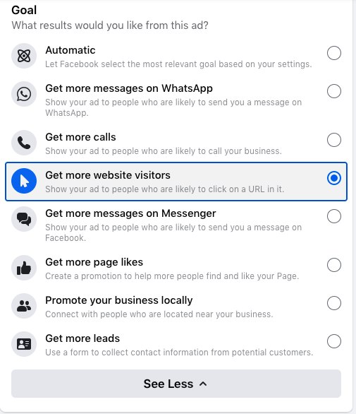

5. Fill in the ad description

    - keep the description short and general
    
    - do not mention payment or other words that could cause the ad to be flagged ( mention of money, els related words like adopted or gaurdianship children)
    
    - typically bablab email is included so they can contact us

5.1. Add ad picture by clicking choose image

   - the picture should also have minimal writing so it runs successfully
    
   - it is okay to say adopted / guardianship in the picture since picture words won't get flagged
    
  - include the irb approval line at the bottom of ad picture when making it on Canva
    
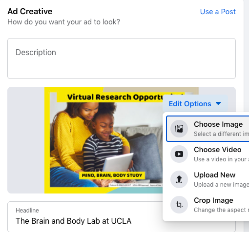

6. Put the url for the lab website page you want to direct participants to.

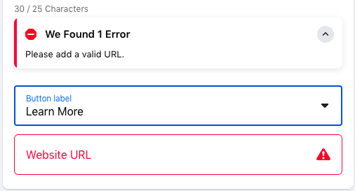

7. For audience chose "People you choose through targeting" and click the pencil to edit the audience.

8. Choose a location for ad to run and add appropriate filters to further target individuals

    - examples of filters used: adoption, parents, parents with young childrenm international adoption
    
    - it is best to start with a bigger audience and then fine tune filters as needed 
    
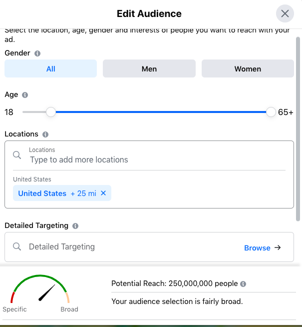

9. Choose how long you want the ad to run

    - let it run for at least three days and a budget of at least $3 a day to maximize chances of it running well.
  
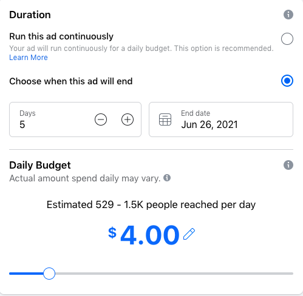

10. Look at the ad previews to make sure everything is correct and the picture is not cropped incorrectly

11. This gives an estimate of the ammount of people we will reach and how much it will cost. Once done looking through it click the submit button at the bottom of the page.
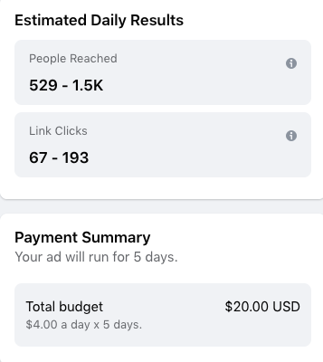

----------

### Instagram Ads

Another way we recruit participants for MBB is by running ads on Instagram through our lab page. Below is all the relevant information for running an Instagram ad. Instagram has been successful for recruiting teens and young adults but not very successful for recruiting lots of parents thus far. 

To run an instagram ad you need to promote a post.

1. Click the plus sign on top right corner of screen then choose post.
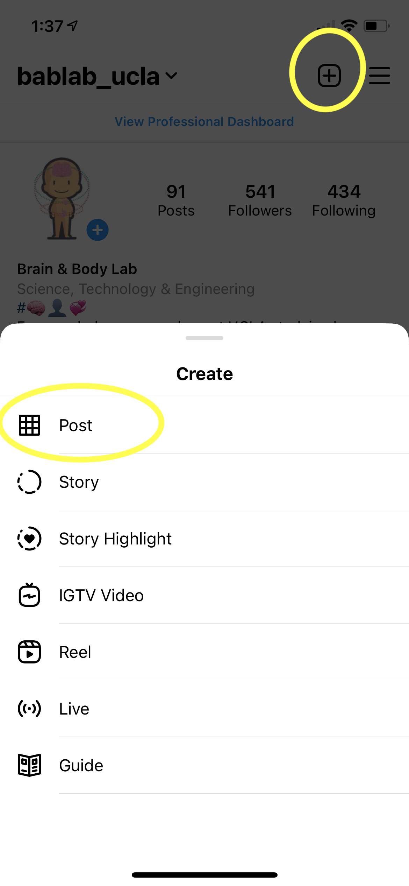

2. Choose picture and click next. On next page it gives you options for filters, just skip that.

3. Write the caption for the post you'll be promoting. Click on the "create a promotion" button to make a promotion from the post. Click share to post the picture to our IG account.
    - keep the caption short and try to avoid words that could get the ad flagged

4. Once the post has been shared to our IG page it should take you directly to the promotion settings. On this page you'll choose the goal for the ad. Choose "more website visits" and make sure the link is correct

5. Here you will define your audience. If audience is els you can choose the ELS filter we previously made.

5.1 If making a new audience filter then choose Create your own

5.1 If creating your own filter ad in location you want for the ad and some filters of who you are trying to target.

  - Examples: parents, parents with young children, adoption
    
  - it is best to start with a bigger audience and then fine tune filters as needed 

6. Choose how long you want the ad to run

    - let it run for at least three days and a budget of at least $3 a day to maximize chances of it running well

7. On the last page it gives you a summary of the ad. Look over it before  submitting the promotion. Lab manager may need to provide payment info to complete transaction. 

#### **Getting Ad Receipts**

**Getting Facebook Ad Receipt**

1) Go to the business Suite from the BAB Lab page
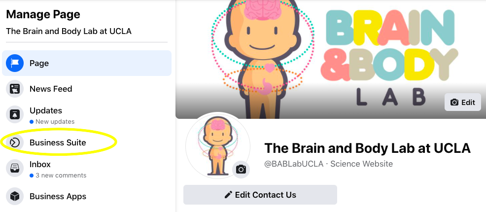

2. Click on more tools.

3. Go to billing option which should open up in a seperate tab.
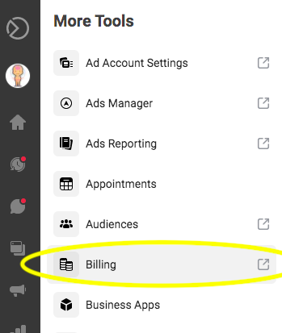

4. If there is an outstanding balance then pay by clicking pay now. After paying the transaction should show up at the top of the list and you can download the receipt using the arrow button. 

**Getting IG Ad receipt**

1. In the IG app, click on the plus sign. 

2. Click on settings on the popup options that will show up.

3. Click on promotion payments

4. If you have already been charged/ paid for the latest ad then click on the Transaction History tab.

4.1. If the top has an outstanding balance then pay by clicking the pay now button. After paying you can click the Transaction History button.

5. Once on transaction history click on the date of when the latest ad was paid for.

6. Click the download button to download the receipt. In most cases you can redirect so it opens on a different page and you can email it to yourself or save as a pdf. 

----------

### Craigslist posting

1. Login into Bablab’s craigslist account. See internal of Lab website for login info
2.	Click on “create a posting.” 

3. Click the option “community”: DO NOT choose “gig offered” because you have to pay for these advertisements.  The community option is free
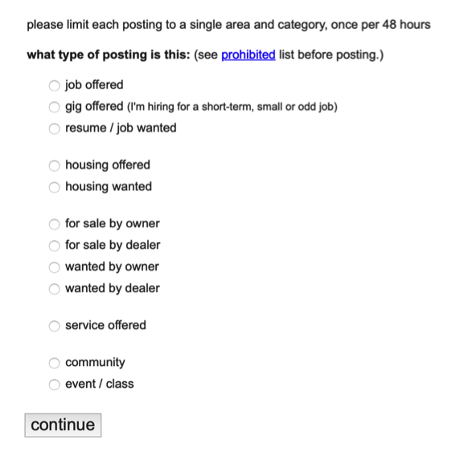

4. Choose “volunteers”. 
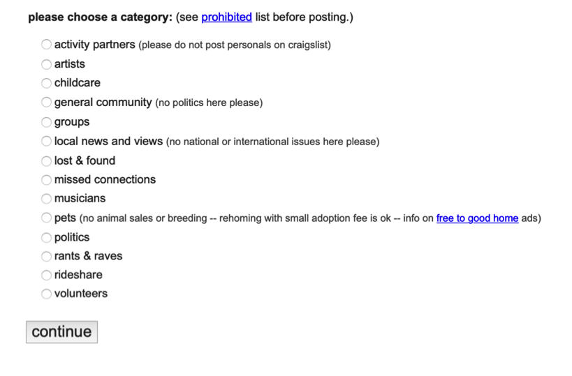

5. Fill out this page based on the research study.  Type “Los Angeles” for the city and the postal code 90095.  Then press continue and post it!

----------

## Research Assistant Hiring

### Not hiring

If we are not looking for research assistants, please respond to any inquiries with the following template.

- [BAB - NOT HIRING]

### Hiring

If we are looking for research assistants, please follow the protocol below. 

1. Qualified candidates should be invited to fill out our form using the folowing template. 

  - [BAB - INVITE APPLY]

2. Candidates to be interviewed should be invited to interview using the following template. 

  - [BAB - INTERVIEW]

3. Candidates we wish to extend an offer to should be emailed using the following template.

  - [BAB - OFFER]

4. Once hired, there are several email templates to welcome/onboard members to the team. Please send the email and follow the instructions in the prompt. 

  - [BAB - ONBOARDING STUDENT]
  - [BAB - ONBOARDING NON-STUDENT]

----------

## COVID-19

### Transition back in-person

**Before coming into the lab...**

1. Check-in with the Lab Manager to ensure you have met all of the requirements (e.g. vaccination status, )

2. Get familiar with the [UCLA Requirements for COVID-19 Symptom Monitoring](https://ucla.app.box.com/s/96on1j6ynhy5c91jdpxxqyi39pl8x796)

3. Try out the [UCLA COVID-19 Symptom Monitoring Survey](https://www.adminvc.ucla.edu/covid-19/ucla-employee-faq/symptom-monitoring)

4. Sign up for your shift on BABLab's shared google calendar 

- Log into your google calendar

- Enable the COVID-19 Protocol calendar shared by the BABLab gmail
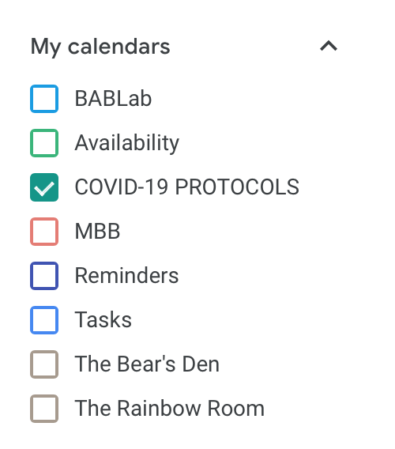

- Sign up for a "shift" on this shared calendar. Add an event during the hours you wish to be present in the lab, using the following format:

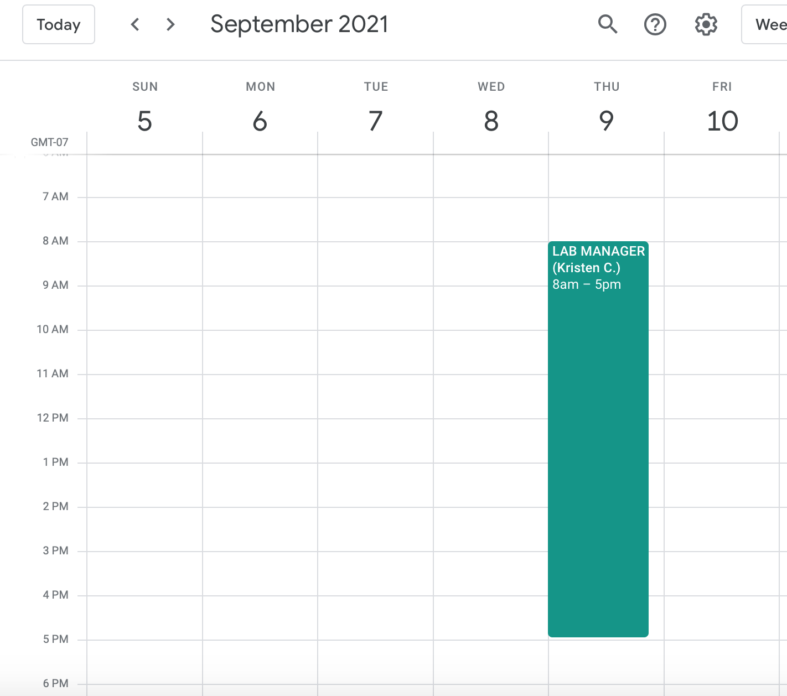

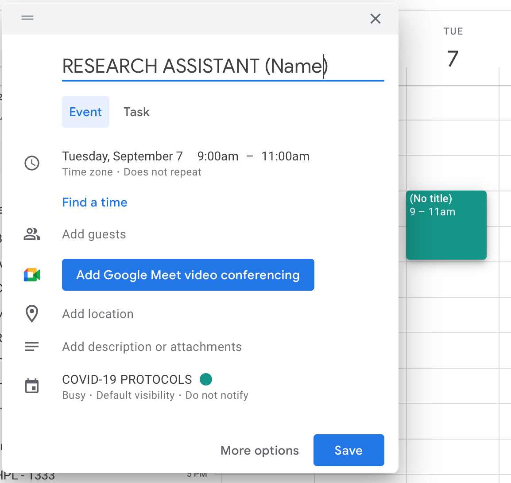

- Only **3 people maximum** can be present in the lab at all times. Postdocs, Graduate Students, and the Lab Manager have priority over shifts in the lab. 

- All parties should sign up for a shift at least *3 days prior to arrival*

- If you are an RA or a Senior RA, your first shift in the lab should always be a time when the Lab Manager is also there. After this, if you are an RA or a Senior RA, you should only go into the lab after having spoken to the Lab Manager and received tasks for in-person work.

**Every time you come into the lab...**

1. A mask is required to be worn at all times while in the lab

2. Try to remain at least a 6-feet distance apart from other folks in the lab

3. Fill out the [UCLA COVID-19 Symptom Monitoring Survey](https://www.adminvc.ucla.edu/covid-19/ucla-employee-faq/symptom-monitoring) to receive clearance prior to coming to the lab and send a screenshot or download of your clearance to the Lab Manager

4. Wipe down and sanitize your work station after you complete your shift

5. Last person of the day should wipe down all the shared tables
