# Research Protocols

----------

## Data Management

----------
 
### Storing Active Datasets
 
Lab data can be stored on Box, the psychology department server, and on external hard drives and CD's. Any data with personally identifying information can only be stored on non-networked, encrypted, external harddrives, flash drives, and CD's. 
 
Although the the data is routinely backed up, the backup is only on-site – so make extra backups! Each lab member should back up raw data on an external hard drive, as well as the code needed to reproduce all analyses. You should not store data locally on your computer (but logging into your Box/server account on your computer is ok).

----------
 
### Data Organization
 
If you have already run several independent projects and have a data organization structure that works well for you, feel free to use it. If not (or if you are looking for a change), the following structure is recommended (based on Neuropipe):

- projectName/subjects
    - individual directories for each of your participants
    - projectName/subjects/{subj}/analysis
        - subject-specific analyses (e.g., 1st and 2nd level analysis – at the run level and experiment level)
    - projectName/subjects/{subj}/data
        - raw data for that participant, with the following directories…
            - behavioralData (for, well, behavioral data)
            - eyetrackingData (if applicable)
            - nifti (raw nifti files / raw MRI and fMRI data)
            - rois (participant-specific ROIs)
    - projectName/subjects/{subj}/design
        - timing files for that participant, with different directories for the different GLMs you’re running (and the different runs in the experiment)
    - projectName/subjects/{subj}/fsf
        - if you’re using FSL, put the .fsf fies here. If you’re using SPM or something else, save the files for setting up preprocessing and GLMs here
    - projectName/subjects/{subj}/scripts
        - Matlab, Python, R, or bash scripts that you used for that participant. You should keep the ‘template’ scripts elsewhere, but you can store scripts you modified specifically for that participant here
- projectName/scripts
    - template scripts and that you may modify for each participant, as well as scripts and functions used for all participants and group analyses
    - recommend making subdirectories for each type of analysis (e.g., behavior, pattern analysis, functional connectivity, univariate)
    - if you have scripts that are the same for each participant, you can have symbolic links for them in your participant-specific scripts directories
- projectName/results
    - figures with main results, powerpoint or keynote presentations, manuscripts if you wish
- projectName/notes
    - detailed notes about the design, analysis pipeline, relevant papers, etc
- projectName/group
    - group analyses
    - recommend making subdirectories for each type of analysis (e.g., behavior, pattern analysis, functional connectivity, univariate)
- projectName/task
    - code for your behavioral experiment, stimuli, piloting information
    - if you are running your presentation code off of the server, it will still be good to have a copy of the code here (but you can keep the stimuli only on the server if you’d like)

When you leave the lab, your projects directories should be set up like this, or something similarly transparent, so that other people can look at your data and code. You must do this, otherwise your analysis pipeline and data structure will be uninterpretable to others once you leave, and this will slow everyone down (and cause us to bug you repeatedly to clean up your project directory or answer questions about it).

----------
 
### Archiving Inactive Datasets
 
Before you leave, or upon completion of a project, you must archive old datasets and back them up. We will develop the instructions for this when we reach our first inactive dataset.

----------

## Ethics

----------

### IRB

**Consent, Assent, and Screening**

Links to [templates](https://ohrpp.research.ucla.edu/consent-templates/) from the UCLA research administration group. 

----------

### IBC

**What is the IBC?**

The IBC is the Institutional Biosafety Committee, which has the same purpose as the IRB but specific to research involving biohazards materials. The IBC is an arm of the UCLA Environment Health & Safety office (EH&S). 

**How to Apply for Approval**

1.  DBS approval and approval to collect any other biological samples is processed through UCLA SafetyNet, the IBC online system, which is the IBC’s equivalent to webIRB. SafetyNet is accessible [here](https://safetynet.research.ucla.edu/) with UCLA logon ID.
    - IBC approval IS needed for blood samples
    - IBC approval IS NOT needed for saliva, stool, or hair samples unless — 
        - Saliva is collected from dental procedures
        - Stool or hair samples are contaminated with blood or infected with pathogens (e.g. HBV, HIV)
2. Once signed in, a new protocol is created by clicking ‘Create BUA’. A BUA is a Biological Use Authorization, which is synonymous with IBC protocol. Completing the BUA is just like completing an IRB protocol, but with a focus on the collection of biological samples. 
3. A BUA (or IBC protocol) requires the following document in addition to information supplied in the online form:
    - Lab Specific Biosafety Manual (includes the following)
        - Laboratory Specific SOPs (based on general template available [here](https://ucla.app.box.com/v/ehs-bio-lab-biomanual))
        - Bloodborne Pathogens Exposure Control Plan (based on general template available [here](https://ucla.app.box.com/v/ehs-bbp-ecp-template))

*NOTE:*

- Consultation with an EH&S is likely necessary to complete the BUA protocol. Contact EH&S or IBC employees with questions at biosafety@ehs.ucla.edu or ibc@research.ucla.edu. 
- All EH&S documents are available [here](https://www.ehs.ucla.edu/documents).
- Additional documents may be required depending on the kind of biological material that’s going to be collected.

4. Once a BUA is completed, it will appear under ‘Submissions.’
5. IBC staff may require that modifications be made to the protocol, just as the IRB would. You may reply to modification requests and make modifications in the same way that you would for an IRB protocol, by logging your response to a reviewers comment and then making the necessary change in the protocol itself.
6. Once all modifications are made, there are two more requirements before a BUA can be approved:

- Staff involved in collecting biological samples must acquire necessary training
    - Training may be completed via the UCLA [WorkSafe](https://worksafe.ucla.edu/Ability/Programs/Standard/Control/elmLearner.wml?PortalID=LearnerWeb) portal accessible with UCLA logon ID. 
        - For Dried Blood Spot collection, the following trainings are required of any staff working directly with samples: 
            - NIH Guidelines for UCLA Researchers IBC Compliance Training (online)
            - Laboratory Safety Fundamentals (online)
            - Blood-borne Pathogens Training (online)
            - Medical Waste Management (online)
            - Biological Safety Cabinet (BSC) (online)
            - Biosafety ABC's - Biosafety Level 2 Training (in-person)
        - The PI is required to complete two courses : 
            - NIH Guidelines for UCLA Researchers: IBC Compliance Training (online)
            - Laboratory Safety for PIs and Lab Supervisors (in-person)
    - Training must be up to date. Training certificates are maintained on the BAB Lab Box at BABLAB/Lab/Training/IBC
    - A room inspection must be done to approve the use of physical space for sample collection and storage. 
- The room inspection is arranged directly with EH&S staff.

----------

## Questionnaire Database

In Box you can find a questionnaire database for the BABLab. This is different from the study specific questionnaire folders! This database is a repository for all of the questionnaires we have used or thought about using in our research. Organizing them here makes it easy for future BABLab members to plan, organize, and reproduce studies! 

This includes the questionnaires used in all of our studies, including source material. In addition, the questionnaire database excel file contains information such as a brief description and reference (needed for IRB protocols and the like).

You can find the questionnaire database at the following path:

- Box/BABLAB/Lab/Questionnaires

You can find the questionnaire database spreadsheet at the following path:

- Box/BABLAB/Lab/Questionnaires/Questionnaire_database.xlsx

When making a new study, please add your questions to the database, including a category and a reference! Adding a category makes it easy to filter this sheet by category when exploring measures. 


Please create a folder for each questionnaire within the database to allow for the organization of source material. For example, the scq (social cravings questionnaire) was adapted from the fcq (food cravings questionnaire). Therefore, in the scq folder I included the original measure for the fcq, and a paper in which it is desribed and validated. In addition, if you have created this questionnaire as an instrument in REDCap - please upload the zipped file of the instrument to this folder! This will save a great deal of time for future researchers!

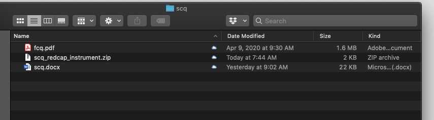

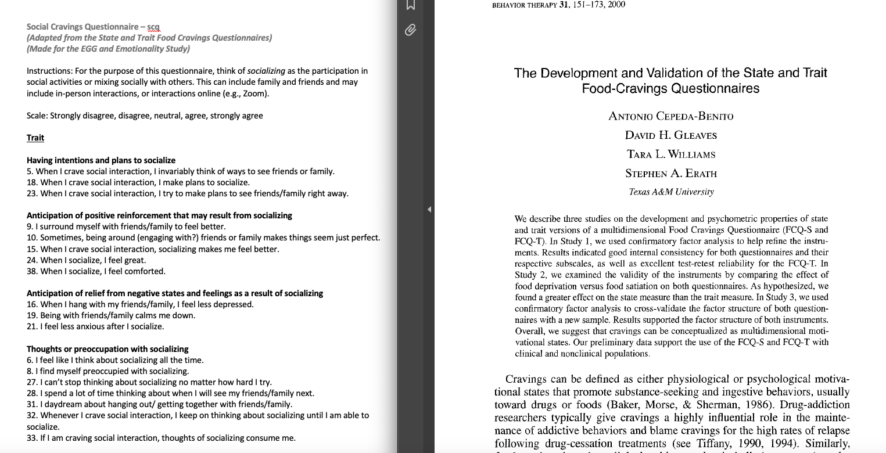

----------

## Interviews

### KSADS

- Align expectations from the start (semi-structured interview)
- Encourage brief responses
- Can write down details later
- Dive in and direct participant
- Read the threshold criteria


----------

## Tests

----------

### WASI

----------

#### WASI Administration

Ensure you have all necessary materials (WASI/WIAT administration instruction sheet, WASI score sheet, pencil with NO eraser, WASI administration booklet, WASI score book)

**Part I: Vocabulary**

*General Instruction*: You will be pointing to each item in the WASI administration booklet and asking the child/adolescent what this item is/if they can describe what this item means to you

1. Start audio recording
2. Flip the WASI administration booklet to page 41, item #4 (what is a shirt?)
3. Flip WASI scoring booklet to page 74, beginning with item #4 (what is a shirt?)
   - Use the WASI scoring booklet to determine if child/adolescent’s description of each item shall be categorized as score 0, 1, or 2
   - *Note*: Q indicated on the scoring booklet refers to prompt/query the child further- “Can you tell me more?”
   - Provide queries as often as necessary- marginal responses, generalized responses, functional responses, and gand gestures, but NOT answers that are clearly incorrect
4. Note score on the WASI score sheet: Vocabulary
5. If the child does not obtain a perfect score on either item 4 or item 5, administer the preceding items in reverse order until two consecutive perfect scores are obtained
6. Stop administering when the child/adolescent receives 3 consecutive Zeros *OR* participant hits max score for age group (age 6: item 22; age 7-11: item 25; age 12-14: item 28)
7. Keep audio recording for Part II: Matrix Reasoning

*Note: These will be audio recorded and can sometimes move quickly- can be scored later*


**Part II: Matrix Reasoning**

*General Instruction*: You will be pointing to each matrix reasoning question in the WASI administration booklet and asking the child/adolescent where this item belongs in the missing box

1. Flip the WASI administration booklet to page 57- Practice Questions
   - Explain you will do a few practice questions first then walk through 2 practice questions
   - You may acknowledge correct responses/explain why answers may be incorrect
2. Flip to correct start page/item to begin (age 6-8: item 1; age 9+: item 4)
   - Do NOT give verbal acknowledgement to their answers (e.g. Correct! That’s right!)
3. If adolescents age 9+ do not obtain a perfect score on either item 4 or item 5, administer the preceding items in reverse order until two consecutive perfect scores are obtained
4. Note score on the WASI score sheet: Matrix Reasoning
5. Stop administering when the child/adolescent receives 3 consecutive Zeros *OR* participant hits max score for age group (age 6-8: item 24)
6. Stop audio recording

----------

#### WASI Scoring

**Part I**

1. Examiner writes “scored by: NAME” at the top of the sheet
2. Fill in any missing scores in Vocabulary or Matrix Reasoning tests using audio file if questions are missing (e.g. scores continue before and after this missing question, NOT because the administrator left questions blank because they have stopped the test)
3. Add up the Vocabulary total raw score:
   - *Note*: Even if a participant begins at item 4 due to age, the total raw score should still include items 1-3
4. Add up Matrix Reasoning total raw score
5. Transfer both total raw scores to front sheet under “Total Raw Score to T-Score Conversion” chart in column titled “Raw Score"


**Part II**

1. Ensure you have the participant’s correct age at day of testing in the upper right corner
2. Open WASI-II Manual book > page 151 for T-Score Conversions
   - Flip to correct chart by age group (age group indicated at top of chart using year:month format)
   - Under the correct chart by age group of the participant, view VC column for Vocabulary and MR column for Matrix Reasoning
      - Scroll down VC column for correct Vocabulary total raw score and acquire T-Score equivalent (horizontally)
      - Scroll down MR column for correct Matrix Reasoning total raw score and acquire T-Score equivalent (horizontally)
   - Write T-Score number in the boxes under “Total Raw Score to T-Score Conversion” chart in column titled “T-Scores”
      - Add T-Scores totals for box titled “Full Scale-2”
      - Copy this total number to “Sum of T-Scores to Composite Score Conversion” chart in column titled “Sum of T-Scores"
3. Flip WASI-II Manual book > page 188 for FSIQ, Percentile Rank, and Confidence Interval
   - **To obtain FSIQ**: Scroll down Sum of T-Scores column and compare horizontally to FSIQ-2 column
   - **To obtain Percentile Rank**: Scroll down Sum of T-Scores column and compare horizontally to Percentile Rank column
   - **To obtain Confidence Interval (always circle/indicate 95%)**: Scroll down Sum of T-Scores column and compare horizontally to 95% column in correct age group
   
----------

### WIAT

----------

#### WIAT Administration

Ensure you have all necessary materials (WASI/WIAT administration instruction sheet, WIAT score sheet, 2 pencils with NO erasers, WIAT word reading list, WIAT Math problems sheet)

**Part I: Word Reading**

*General Instruction*: You will be asking the child/adolescent to read off the WIAT word reading list left to right, top to bottom until they can no longer read the words

1. Start audio recording
2. Note in scoring sheet what grade participant is in
3. Note the following basic scoring instructions:
   - **(1)** if fluent/correct
   - **(DK)** if the child does not know
   - **(>3)** if it took the child longer than 3 seconds to say
   - **(SC)** if the child said the word wrong but self-corrected
4. If multiple attempts are made to read a word, score only the last attempt
5. If the child is sounding the word out/verbalizes the word in a choppy manner, ask the child to “read the word altogether” immediately after
   - If the next attempt is not fluent, score as 0 and say “try the next one”
6. If the child skips a word or row, redirect the child to the appropriate place immediately after and make a note in the scoring sheet
7. If the child was unclear when reading a word/you did not hear the child correctly, ask the child to repeat the whole row of words where this particular word was located at the very end after they have finished reading all they can
8. Discontinue after the child has reached 4 consecutive Zeros

**Part II: Numerical Operations**

1. You will be asking the child to fill out the “math worksheet” him/herself
   - Indicate where to begin based on age (Grades K-1: item 1; grades 2-4: item 14; grades 5-12+: item 18)
   - Explain to the child/adolescent to work on problems from left to right, top to bottom in order and if they do not know a question they may skip it
   - If beginning at item 1, refer to WIAT scoring sheet for specific verbal administration instructions
2. If child does not reach 3 consecutive scores of 1, reverse backward until child has reached a correct response
3. Be sure to pay attention to the child’s responses- if the numbers they write are illegible or mirrored, ask the child to verbally indicate the response they meant
   - Note that you obtained a verbal response and note the actual response in your WIAT score sheet
4. Discontinue this task when they have reached 4 consecutive Zeros
5. Stop audio recording

----------

#### WIAT Scoring

**Part I**

1. Examiner writes “scored by: NAME” at the top of the sheet
2. Fill in any missing scores in Vocabulary or Matrix Reasoning tests using audio file if questions are missing (e.g. scores continue before and after this missing question, NOT because the administrator left questions blank because they have stopped the test)
3. Add up the Word Reading Total Raw Score:
   - Add up Word Reading Total Score Box
   - Add up Total >3" Box
   - Add up Total SC Box
4. Word Reading Speed Total Raw Score:
   - Listen to the audio file and note time participant began to read words
   - Count 30 seconds forward
   - Note the word the participant completed at 30 seconds; write item number of this word in box
5. Add up the Numerical Operations Total Raw Score
   - *Note*: Even if a participant begins at item 8 due to age, the total raw score should still include items 1-7
6. Transfer both Word Reading Total Raw Score and Numerical Operations Total Raw Score to front page under “Composite Score Summary” chart

**Part II**

1. Ensure you have the participant’s correct age at day of testing in the upper right corner
2. To obtain the Composite Standard Score:
   - Flip WIAT-III Manual book > page 252-387 for Table C.1 based on age of participant (noted at top of chart by year, month, days range)
   - Scroll down Word Reading column and compare horizontally to Standard Score column; write standard score in “Composite Standard Score” box
   - Scroll down Numerical Operations column and compare horizontally to Standard Score column; write standard score in “Composite Standard Score” box
3. To obtain the Confidence Interval (always at 95%):
   - Flip WIAT-III Manual book > page 392 for Table C.3
   - Follow column for correct age > 95% > Word Reading
      - Add and subtract this number to/from the Composite Standard Score: Word Reading to create highest and lowest numbers for the Confidence Interval
   - Follow column for correct age > 95% > Numerical Operations
      - Add and subtract this number to/from the Composite Standard Score: Numerical Operations to create highest and lowest numbers for the Confidence Interval
4. To obtain GRADE-LEVEL equivalents of score: (*Note: No longer doing percentile*)
   - Flip WIAT-III Manual book > page 398 for Table D.2
      - Scroll down through Word Reading column and look for raw score, view to left column for grade equivalent
   - Flip WIAT-III Manual book > page 402 for Table D.2
      - Scroll down through Numerical Operations column and look for raw score, view to left column for grade equivalent

----------

## Behavioral Coding

----------

### FIMS

- Always code positive video first (could be colored by negative video)
- When not obvious use the process of elimination
- Make notes while coding
- Maturity for child for their age
- Attunement = harmonious 

----------

## Physiological Measurement

----------

### ECG

Electrocardiogram (ECG) measures a subject’s heart rate and waveform pattern. With each heartbeat, an electrical signal travels through the heart. This electrical wave causes the muscle to squeeze and pump blood from the heart. ECG measures this wave through electrodes placed across the torso. By collecting ECG, you can detect changes in heart function due to certain stimuli. Things like stress, excitement, fear, and other emotional responses can be physiologically measured based on changes in the ECG readouts.

**Biopac Setup**

- In our ECG setup, we have one transmitter with one channel.
- The red and white leads are the signal, the black lead is the ground.
- Because we are using a wireless setup, there needs to be a clear line of sight between the transmitter and the receiver.

**Electrode Placement**

- We will be placing 2 electrodes just below the collarbones and one electrode on the lowest left rib.

**Filtering and Signal Frequency**

- We will sample ECG at a rate of 2kHz, or 2000 samples/second. This gives us a resolution high enough to catch all of the important parts of the heartbeat waveform. 
- Noise is not much of an issue with collecting ECG in a 3-electrode setup.

**Subject Position**

- Ensure that the subject is in a comfortable position, so that body movement can be completely avoided or reduced to the minimal. The subject should be asked not to talk, move, read or make phone calls during the procedure.
- Ensure that the position of the subject is the same if there are multiple sessions. Timing of unavoidable body movement or motion artifacts should be noted and the recording periods with motion artifacts must be removed before analysis.

**Gathering ECG Data**

- Lightly abrade the skin at the electrode sites with EL-Prep Gel
- Wipe off excess with a wet wipe or tissue
- After prepping the electrodes with Gel-100, attach electrodes to the skin at the three positions indicated above
   - Let these sit as long as possible to adhere and for the gel to soak in
- Ask the participant to put on the module like a belt around their torso
   - Make sure the electrode lead inputs are pointed up towards their head
- Connect the white lead to the Right Collarbone electrode, connect the black lead to the Left Collarbone electrode, and connect the red lead to the Left Rib electrode
- Turn on the transmitter and ensure that both the light on the Biopac receiver module and the transmitter are green (the transmitter should be flashing, whereas the receiver should be solid)
- Make sure there is a clear, unobstructed line of sight between the transmitter and receiver antenna
- Open AcqKnowledge by selecting the template file on the desktop
   - If the system is not connected to the hardware, make sure the wifi is turned off and restart AcqKnowledge
- Ensure all devices are connected and lead wires attached properly
- Hit the green “Start” button and click through all of the dialog boxes that you’re prompted with

-----------

### EGG

**Biopac Setup**

- In our EGG setup we have one transmitter with two channels (A and B). 
- The white leads are the reference, the red are the signal, and the black is the ground. 
- Each transmitter needs to have a ground. 
- Because we are using a wireless setup, there needs to be a clear line of sight between the transmitter and the receiver.

**Electrode Placement**

- We will place the two white electrodes side-by-side on the xyphoid (which is the lower part of the sternum). 
- We will place the two red electrodes in position 1 and 4 in the diagram above. 
- We will place the black electrode (the ground) on the second from bottom rib on the left. Try to get it over the bone as much as possible. 
- Position 1 should be in line with the reference electrode, and position 4 should be in line with the ground.
- Next, we need to have the transmitter up high on the participants chest so there is line of sight between the transmitter and receiver (antenna).

*Alternative*:

- Regular electrocardiogram (ECG) electrodes can be used for EGG recordings.
- The most commonly used configuration for recording 1-channel EGG is to place one electrode at the midpoint on a line connecting the xiphoid and umbilicus, and the other electrode 5 cm away (up and 45 degree) to the patient’s left. 
- The ground electrode is placed on the left costal margin horizontal to the first active electrode.

**Filtering and signal frequency**

- *Amplification*: the EGG signal is usually in a range of 50-500 μV and adequate amplification needs to be provided by a recording device so that the amplified signal is of an appropriate range for display and analysis
- *Filter setting*: determines the frequency range of the EGG signal to be maximally amplified. The interested range of the EGG signal is in the range of 0.5-9.0 cpm or 0.0083 to 0.15 Hz which is much lower than that of most of extracellular recordings. 
   - In addition to the basic fundamental frequencies of 0.5-9.0 cpm, it is also important to record certain harmonics (multiples of the fundamental frequency). Accordingly, an appropriate frequency setting is in the range of 0.0083 to 1 Hz.

**Skin Preparation**

- First, the abdominal skin where the electrodes are to be positioned should be thoroughly cleaned to ensure that the impedance between the pair of electrodes is below 10 kΩ. 
   - To do so, it is advised to abrade the skin until it turns pinkish using some sandy skin-preparation jelly, and then apply a thin layer of electrode jelly for 1 minute for the jelly to penetrate into the skin.
- Before placing the electrode, the excessive jelly must be completely wiped out.

**Subject Position**

- Ensure that the subject is in a comfortable position, most commonly supine, so that body movement can be completely avoided or reduced to the minimal. The subject should be asked not to talk, move, read or make phone calls during the procedure.
- Ensure that the position of the subject is the same if there are multiple sessions. Timing of unavoidable body movement or motion artifacts should be noted and the recording periods with motion artifacts must be removed before analysis.

**Duration of Recording**

- A common mistake in recording the EGG is that the recording is too short. Unlike the ECG in which there are about 60 waves every minute, the EGG is composed of only 3 waves every minute. That is, if the recording is of a short duration of 5 minutes, there are only 15 waves which are obviously insufficient for analysis and interpretation.
- Ideally, at least a 30-minute period is needed to ensure an accurate measure of gastric slow waves in a particular state, such as fasting, fed, baseline or after intervention.

**Meals**

- We will ask participants to eat something about 1 hour before they come into the lab.
- Then we will give them water (as a test meal) immediately before performing the EGG.
- The subjects should all drink the same amount of water.

**Analysis**

- The EGG also contains respiration artifact that is between 12-25 cpm and sometimes the ECG artifacts (＜ 60 cpm). Occasionally, the slow wave of the small intestine may also be recorded in the EGG (9-12 cpm). 
- Although these interferences distort gastric slow waves in the EGG, their frequencies do not overlap with that of the gastric slow waves. Consequently, spectral analysis can be performed to separate the gastric slow waves from interferences. 
- Before spectral analysis is performed, any periods with motion artifacts must be identified and deleted because motion artifacts can not be separated from the gastric slow waves even with spectral analysis. So we will need to record their motion during the task.

**Dominant Frequency and Power**

- The dominant frequency and power of the EGG can be derived from the power spectral density assessed by the periodogram method. The normal range of the dominant frequency of the EGG is between 2 to 4 cpm. 
- The EGG is called bradygastria if its dominant frequency is lower than 2 cpm, tachygastria if its dominant frequency is higher than 4 cpm but lower than 9 cpm, and arrhythmia if there is no dominant peak power in the spectrum 

**Power Ratio or Relative Electrogastrography**

- *Power Change*: The ratio of dominant EGG powers after and before an intervention is a commonly used parameter that is associated with alteration in gastric contractions. It is generally accepted that a ratio of ＞ 1 reflects an increase in gastric contractility due to the intervention, whereas a ratio of ＜ 1 reflects a decrease in gastric contractility.
   - If the decibel (dB) unit is used, the ratio should be replaced by the difference between the baseline and after intervention.
- *Percentage of Normal Gastric Slow Waves*: The percentage of normal slow waves is a quantitative assessment of the regularity of the gastric slow wave measured from the EGG. It is defined as the percentage of time during which normal gastric slow waves are observed in the EGG. The percentage of normal slow waves can be computed from the running power spectra of the EGG.
   - In this method, 1 spectrum is derived from every 1 minute (or some other short period) of EGG data; the minute is considered normal if its EGG spectrum exhibits a dominant power in the range of 2-4 cpm. In humans, the normal percentage of gastric slow wave is defined as 70%.
- *Percentage of Gastric Dysrhythmia*: The percentage of gastric dysrhythmia is defined as the percentage of time during which gastric dysrhythmia is observed in the EGG. It is computed in the same way as that for the percentage of normal slow waves.
   - It is further classified into the percentage of bradygastria, the percentage of tachygastria and the percentage of arrhythmia. 

------------

### GSR

Electrodermal response (EDR) measurements (including Galvanic Skin Response, GSR) show the activity of the eccrine sweat glands. Typically, one will place electrodes where the concentration of these glands is the highest: namely, the fingertips. The activity of the eccrine sweat glands as a response to physiological excitation (stress, fear, etc.) serves to increase the conductivity of the skin when activated. When one applies a very small electric voltage (0.5 V) between two electrodes, the manifested electrical conductance varies in direct proportion to the electric current flowing between the electrodes. For instance, if a subject is presented a stimulus and the palms start to sweat, this response indicates a highly-stimulated state. The EDR of this subject will then be higher than the subject’s baseline. If another subject receives the same stimulus and the palms remain as "cool as a cucumber," the EDA reading will remain unchanged with respect to the baseline. EDR undergoes relatively fast habituation (decrease of amplitude) in the event the same stimulus is repeated over and over to the same subject.

**Biopac Setup**

- In our GSR setup, we have one transmitter with one channel.
- The red lead is the signal, the black lead is the ground.
- Because we are using a wireless setup, there needs to be a clear line of sight between the transmitter and the receiver.

**Electrode Placement**

-  We will be placing the signal electrode on the middle finger of the child’s non-dominant hand. 
    - This has been noted to be the region of the hand with the most concentrated and reactive eccrine sweat glands, and using the non-dominant ensures that the participants will be able to continue with other activities that they may be tasked with while hooked up to the GSR module. 
- The ground electrode can be attached anywhere within reach of the transmitter leads. While the above paper grounded to a position on the participant’s arm, for the sake of consistency and simplicity, we are attaching the second electrode to the participants’ index finger (on the same hand). 
    - This provides an effective ground, consolidates the leads into one area (preventing potential interference or having the electrodes pulled off by strain on the leads), and also standardizes the placement across all the participants.

**Filtering and Signal Frequency BioPac Recommendation**

- The sample rate can be set quite low for long-term ambulatory measurements or experiments that do not require a high level of temporal precision (i.e., 1-5 samples per second). However, lower sample rates cannot ensure that specific events are accurately represented in what is relayed and graphed, and a degree of timing error might occur. 
   - To avoid this, BioPac recommends the sampling rate be set to a minimum of 2000 samps/sec (2KHz). Higher sample rates are useful for a number of methodological reasons and for improvements in precision. 
- For EDA/GSR measurements, it is typical to filter the data at 35Hz. Some recommendations are that a sample rate of 200Hz - 400Hz are a minimum to ensure enough samples for accurate separation of phasic waveforms from tonic signals and a more accurate representation of signal shape. 
- A general approach is to always err on the side of caution and probably seek to sample higher than you really need. As a general rule 1000Hz - 2000Hz sample rates are more than sufficient and easily achievable. The decision for the present study is to collect at a sampling rate of 2000Hz.

**Subject Position**

- Ensure that the subject is in a comfortable position, so that body movement can be completely avoided or reduced to the minimal. The subject should be asked not to talk, move, read or make phone calls during the procedure.
- Ensure that the position of the subject is the same if there are multiple sessions. Timing of unavoidable body movement or motion artifacts should be noted and the recording periods with motion artifacts must be removed before analysis.

**Gathering GSR Data**

- Don’t abrade the skin
- After prepping 2 electrodes with a dab of Gel101, attach them to the child’s middle and ring fingers
   - Let these rest to let the adhesive set and gel soak in for 5 minutes
- Ask the child to put on the PPGED transmitter like a wrist watch. Assist if needed.
- Attach the transmitter leads to the electrodes (red to middle, black to pointer)
   - These should be the only two leads connected to the device
   - If there are more leads present, ensure you have the correct transmitter and that the correct lead set is plugged in
- Turn on the transmitter and ensure that both the light on the Biopac receiver module and the transmitter are green (the transmitter should be flashing, whereas the receiver should be solid)
- Make sure there is a clear, unobstructed line of sight between the transmitter and receiver antenna
- Open AcqKnowledge by selecting the template file on the desktop
   - If the system is not connected to the hardware, make sure the wifi is turned off and restart AcqKnowledge
- Ensure all devices are connected and lead wires attached properly
- Hit the green “Start” button and click through all of the dialog boxes that you’re prompted with

----------------

## Git

To use GitHub and other Git applications, you will need to install Git on your local computer. Git runs in the background and performs tracking and version control for you. This is similar to the way that RStudio runs on top of R. 

To install Git:

1. Go [here](https://git-scm.com/downloads)
2. Use the [homebrew](https://brew.sh/) method
   - Type this line of code into your terminal and press enter 
   - When you see the instructions RETURN - press enter again
   - You may have to enter your password, if it looks like you aren't entering text, you really are, so just type and press enter

```
/bin/bash -c "$(curl -fsSL https://raw.githubusercontent.com/Homebrew/install/master/install.sh)"
```

3. Once that has installed, type this code into your terminal and press enter

```
brew install git
```

4. Git should now be installed


----------------

## GitHub


1. Download [GitHub Desktop](https://desktop.github.com/)


2. Create new repository on GitHub Desktop


- Make sure to select the correct parent folder

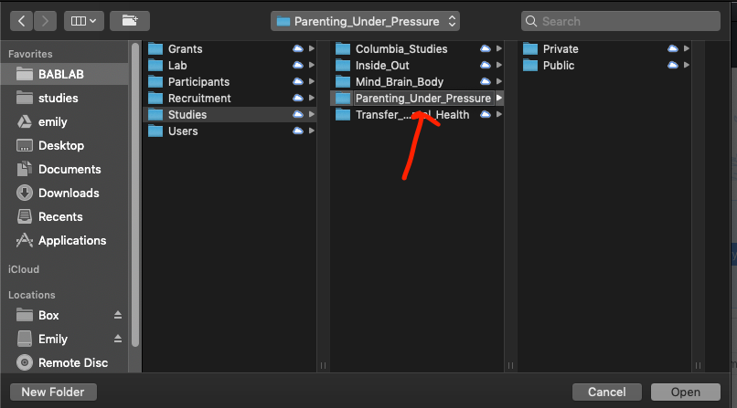

3. Initialize the repository 


- If you press command + shift + . you can see the hidden git files


4. Add your files to the folder

5. Open back to GitHub Desktop

- The blue dot means there are changes in that folder to commit

6. Publish the repository (this sets up the repository online - choose which organization it should go to)

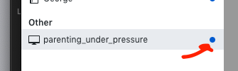

7. Create the first commit and publish the repository (add a comment and select your organization)

- Committing saves the changes to your local git (your local computer record of changes)(local changes)


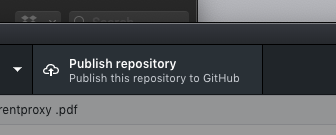


8. Push the repository 

- Push the changes that git has catalogued to the online GitHub

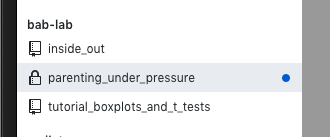


9. Go to GitHub online and you can see your repository with all of your files and latest commits

- Important to note that the README file will display as the main page for the repository

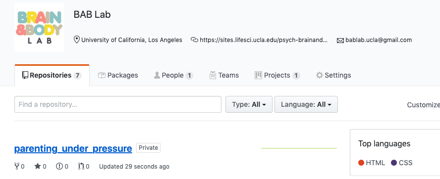


10. If you click on the commits button, you can browse your entire history of commits, explore the file, and download the version from any point in it's history

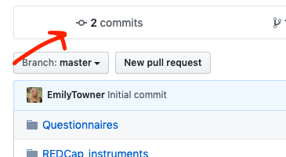
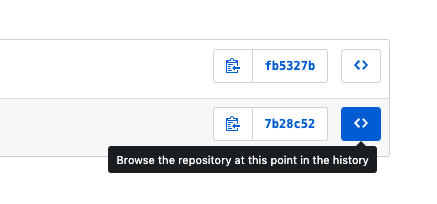


11. Adding a .gitignore file will allow you to "skip" over certain types of files that you don't want to commit

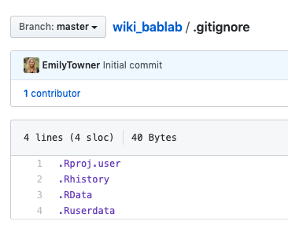

12. You can change the name of the root folder on your local directory - just be sure to use the "locate" function in GitHub Desktop to locate it


13. Make your respository public

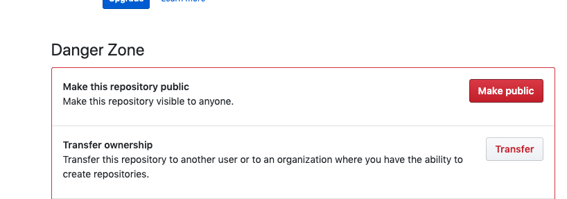

**For a more thorough description of Git, see this [article](https://vuorre.netlify.app/publication/2018/06/01/curating-research-assets-a-tutorial-on-the-git-version-control-system/vuorre-curating-research-assets-2018.pdf).**

**Vuorre, M., & Curley, J. P. (2018). Curating Research Assets: A Tutorial on the Git Version Control System. Advances in Methods and Practices in Psychological Science, 1(2), 219–236. https://doi.org/10.1177/2515245918754826**

### How to use GitHub like a Software Developer

The above method is great if you are working alone in your own repository, but it doesn't work well for collaboration, because only one git repository can be linked to a folder at one time. GitHub has an integrated workflow for this.


**Collaborative Workflow**

1. Fetch
2. Code
3. Build / Knit (Build is for Wiki's/Books - Knit is for regular Rmarkdown files)
4. Commit
5. Push
6. Pull
7. Merge
8. Repeat

--

1. The first step in a collaborative repository is to create your own branch on GitHub.com.  
   - NEVER work directly in the master branch - you might break something
   - Name it after yourself (this will be your workspace)
   
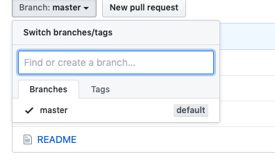

2. Clone the repository from your organization into a local directory on your computer using GitHub Desktop
   - Anywhere is fine as long as it's not a shared folder (no shared Box, Google Drive, Dropbox, etc.)
   - Box, Dropbox, Google Drive folders are fine as long as you are the ONLY user
   


3. Then navigate to current branch on GitHub Desktop and select your branch

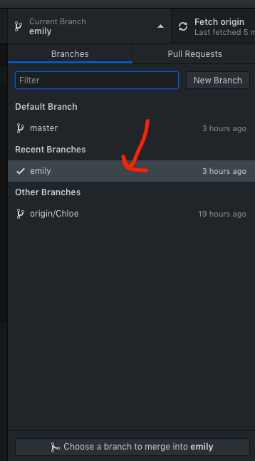

4. Now we start the 7 step cycle ->

--

1. Fetch origin - this fetches any changes that have been made since the last time you worked on the project


2. Code - now you can edit the code, make/add/remove things etc.

3. Build/Knit - when you are done making your desired changes, click build or knit

4. Commit - Commit your changes using GitHub Desktop
   - This is kind of like saving the changes to your local computer change tracker
   - Make sure you put a comment in the box (no description necessary)
   - Make your comment useful to those reviewing it
   


5. Push - now push your changes to GitHub.com - this is like saving your local changes online

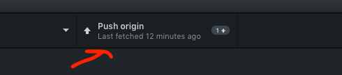

6. Pull - Now, in order to integrate your changes with the master copy (which hosts the public facing ebsite) you need to submit a pull request. 
   - This means that you want the owner of the repository to pull in your changes to the master branch
   - This will take you to GitHub.com, follow the instructions to create your pull request

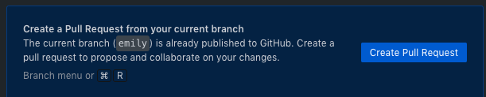

7. Merge - on GitHub.com, the owner of the repository will then be able to review your pull request, fix any conflicts, and merge the branch into the master. Usually, this is pretty simple if there aren't any conflicts!


8. Repeat - now before you start new work, make sure to fetch origin and repeat the process.

----------------

## OSF

1. Create a new project on OSF


2. Title it and choose storage location (US)


3. Navigate to the new project and click Add Ons

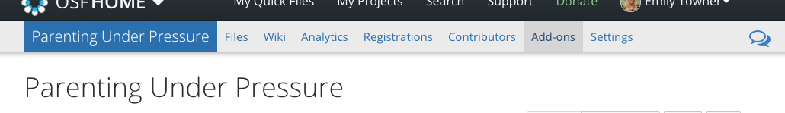

4. Enable GitHub


5. Link OSF to your GitHub account

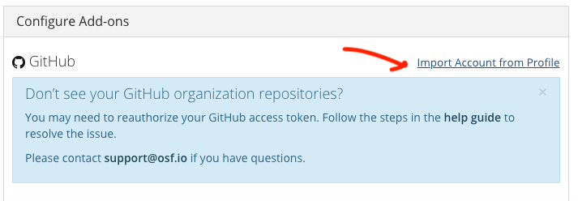
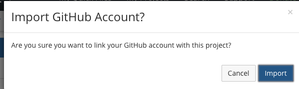

6. Select the repository you want to link


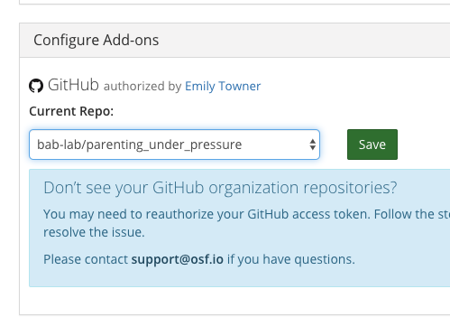

7. Now all of your files are visible in the OSF project

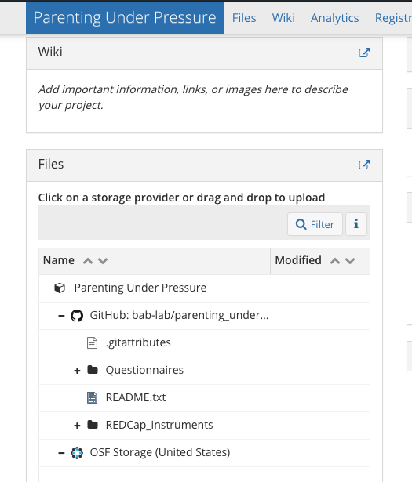

8. Make your OSF project public


----------------

## Wiki Creation

**In order to properly build the wiki you will neet to install [LaTex](https://www.latex-project.org/)**

*This is a huge installation, so leave plenty of time*

**You will also need to have the bookdown package installed in R-Studio**

*To install and load bookdown in R run the following code*

`install.packages('bookdown')`

`library(bookdown)`

1. Create a new project based on the wiki template (duplicate and rename for your project/study)


2. Rename any instance of "Template" to your project's title (open using RStudio)

- .Rproj itself (YOU MUST OPEN THIS PROJECT FILE TO GET STARTED)
-  _bookdown.yml file
- _output.yml file
- index.rmd file

3. Each .Rmd file creates a section

- Index is always the home page
- You can create subsections by creating new .Rmd files - 
- These files use markdown syntax

4. Create a new repository using GitHub Desktop for the wiki

5. Move all the files from your draft into the repository folder, commit, and push

- Make sure to always BUILD before you commit and push so that all the necessary files are updated

6. Go into settings in GitHub online

- Scroll down to GitHub pages
- Select master/branch/docs folder to set your GitHub Pages site to the docs folder within your bookdown files


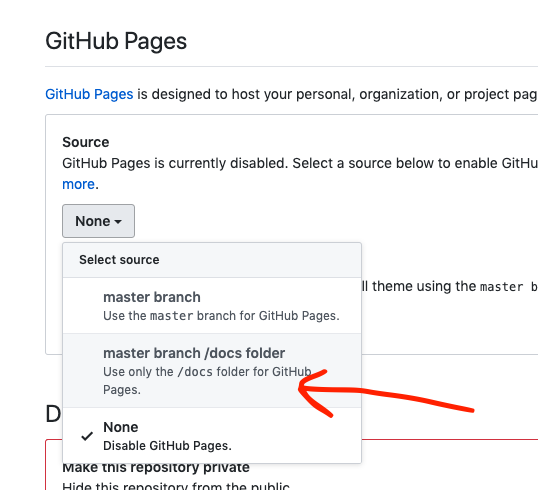
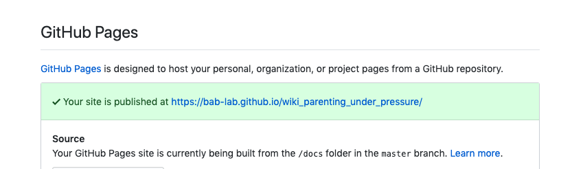

7. Put the link on OSF to the wiki


